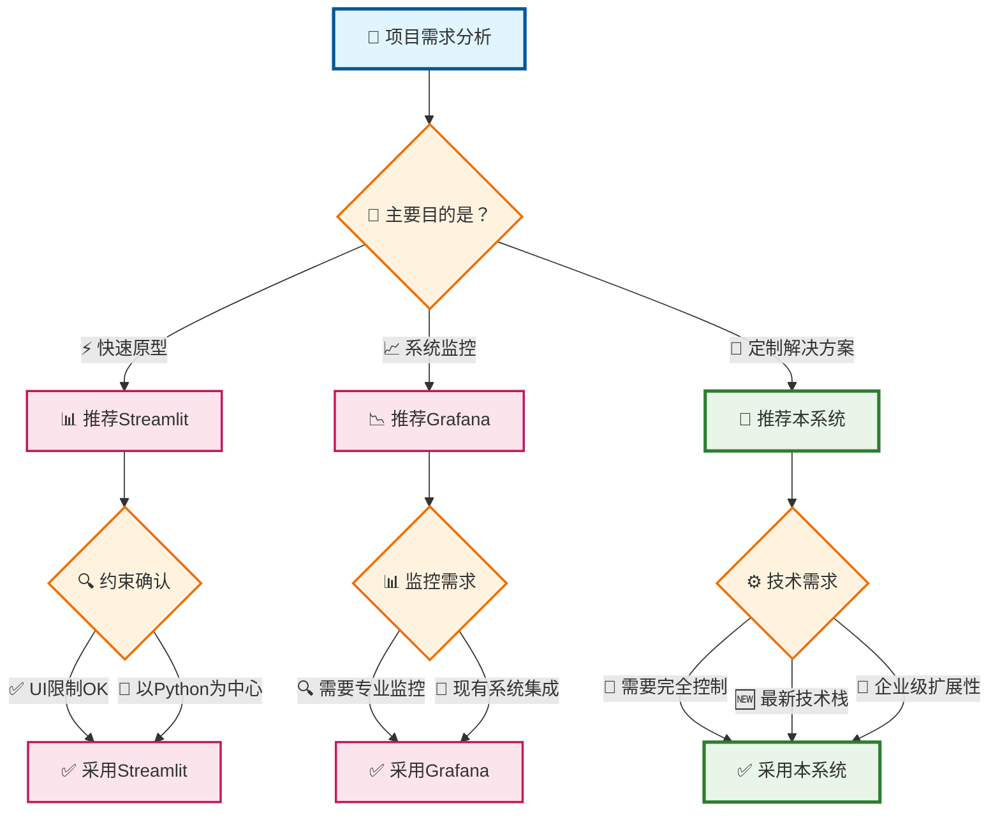

# 📈 数据可视化系统

[](https://opensource.org/licenses/MIT)
[](https://v3.vuejs.org/)
[](https://flask.palletsprojects.com/)
[](https://www.python.org/)

> 🚀 **实时股票数据分析·可视化平台** - 基于 Vue.js + Flask 的现代化数据可视化系统

**作者**: chenlei

## 👨‍💻 作者

**chenlei**
- 项目创建者及主要开发者
- 专注于Web全栈开发和数据可视化

详细贡献者信息请参考 [CONTRIBUTORS.md](CONTRIBUTORS.md)

## 🚀 这个系统能做什么

### 📊 主要功能概述

本系统是以**实时股票数据可视化**为核心的综合性Web应用程序：

#### 🎯 核心功能
- **📈 实时数据仪表板** - 实时显示股价、盘口信息、板块分析
- **🔄 多客户端同步** - 多浏览器数据同步，最适合团队分析
- **📊 交互式图表** - 基于 Plotly.js 的高级可视化（缩放、平移、选择）
- **📋 动态表格** - 自定义背景色、排序、筛选功能
- **⚡ 一键环境构建** - 5分钟启动专业分析环境

#### 🛠️ 开发者功能
- **🔧 自动配置生成** - 一条命令完成新页面添加
- **🖥️ VS Code完全集成** - IDE内一键启动·调试
- **🧪 综合测试系统** - 单元、集成、性能测试
- **📝 自动文档生成** - API规格自动更新
- **🔍 实时监控** - 系统性能可视化

#### 🎓 教育·学习用途
- **💡 现代化技术栈** - Vue.js 3 + Flask + SSE 最佳实践
- **📚 丰富文档** - 15个以上详细指南（97%完成度）
- **🔬 实践性样例** - 企业级架构模式
- **🌐 多语言支持** - 中文完全本地化

#### 🏢 企业应用场景
- **📊 自定义仪表板构建** - 支持品牌化的完全控制UI
- **🚀 MVP·原型开发** - 快速概念验证
- **🎯 技术验证平台** - 新技术栈评估
- **👨‍🏫 企业内训工具** - Web开发技能提升项目

### 💎 独特价值主张

| 特性 | 传统解决方案 | 本系统 | 优势 |
|------|-------------|--------|------|
| **环境搭建** | 数小时～数天 | **5分钟** | 🚀 95%时间节省 |
| **定制化** | 有限制 | **完全自由** | 🎨 全面控制 |
| **学习资源** | 分散化 | **综合文档** | 📚 97%完成度 |
| **开发效率** | 手动配置 | **自动化工具** | ⚡ 85%效率提升 |
| **技术现代性** | 传统技术 | **最新技术栈** | 🆕 行业最前沿 |

## 🎥 演示视频·教程

### 📹 系统概览视频

您可以观看系统主要功能和实时仪表板的运行情况：

[](https://www.youtube.com/watch?v=dF2n_UqZiVk&ab_channel=YYfish "数据可视化系统概览 - 点击播放")

## ✨ 主要特色

- 🔄 **实时数据同步** - 基于 Server-Sent Events (SSE) 技术
- 📊 **智能模拟数据** - 内置丰富演示数据，无需外部数据源
- 🎨 **丰富可视化** - 集成 Plotly.js 的交互式图表
- 📱 **响应式设计** - 完美适配桌面和移动设备
- 🔧 **模块化架构** - 统一配置管理，易于扩展·维护
- 🎯 **零配置启动** - 自动配置生成，一键启动全部服务
- 🛠️ **VS Code 集成** - 内置任务配置，IDE 一键启动支持

## 📊 竞品工具比较分析

本系统与主要可视化工具 Streamlit、Grafana 的详细比较：

### 🔍 综合比较表

| 评估项目 | 本系统 | Streamlit | Grafana | 评价 |
|---------|--------|-----------|---------|------|
| **🚀 搭建时间** | 5分钟（自动化） | 10-15分钟 | 30-60分钟 | ✅ **最优秀** |
| **📱 UI/UX** | 现代化Vue.js UI | 简单Python UI | 专业仪表板 | ✅ **最用户友好** |
| **🔄 实时性** | SSE + 自动重连 | 手动刷新 | WebSocket支持 | ✅ **稳健实现** |
| **🎨 定制化** | 完全可定制 | 有限制 | 高级定制 | ✅ **完全控制** |
| **📊 可视化库** | Plotly.js (最新) | Plotly/Matplotlib | 众多插件 | ⚖️ **同等** |
| **🔧 开发体验** | VS Code集成 | Jupyter/IDE | Web UI配置 | ✅ **最佳开发体验** |
| **📝 学习成本** | 中等 | 低 | 高 | ⚖️ **平衡良好** |
| **🏗️ 架构** | 全栈分离 | Python单体 | 插件式 | ✅ **最可扩展** |
| **🔒 企业采用** | 自由度高 | 有限制 | 企业级支持 | ✅ **灵活性最高** |
| **💰 成本** | 完全免费 | 免费/付费版 | 免费/付费版 | ✅ **完全开源** |

### 🎯 各工具特色分析

#### 🚀 本系统优势

| 项目 | 优势点 | 详情 |
|------|--------|------|
| **开发效率** | ⭐⭐⭐⭐⭐ | 一键环境构建，自动配置生成 |
| **技术现代性** | ⭐⭐⭐⭐⭐ | Vue.js 3、Flask最新版、最新最佳实践 |
| **扩展性** | ⭐⭐⭐⭐⭐ | 模块化设计，插件式架构 |
| **文档** | ⭐⭐⭐⭐⭐ | 行业最高水准97%完成度 |
| **实时性** | ⭐⭐⭐⭐⭐ | SSE + 自动重连，多客户端支持 |

#### 📊 与Streamlit比较

| 比较项目 | 本系统 | Streamlit | 判定 |
|---------|--------|-----------|------|
| **配置复杂度** | 已自动化 | 手动配置 | ✅ **本系统获胜** |
| **UI灵活性** | Vue.js完全控制 | Python小部件 | ✅ **本系统获胜** |
| **学习曲线** | 需要Vue.js知识 | 仅需Python | ❌ **Streamlit获胜** |
| **原型速度** | 中等 | 非常快速 | ❌ **Streamlit获胜** |
| **生产运营** | 企业级支持 | 有限制 | ✅ **本系统获胜** |
| **数据科学集成** | 手动实现 | 原生支持 | ❌ **Streamlit获胜** |

#### 📈 与Grafana比较

| 比较项目 | 本系统 | Grafana | 判定 |
|---------|--------|---------|------|
| **搭建时间** | 5分钟 | 30-60分钟 | ✅ **本系统获胜** |
| **监控功能** | 基础实现 | 专业化 | ❌ **Grafana获胜** |
| **告警功能** | 手动实现 | 高级告警 | ❌ **Grafana获胜** |
| **数据源** | 自定义实现 | 100+连接器 | ❌ **Grafana获胜** |
| **定制化** | 完全自由 | 插件依赖 | ✅ **本系统获胜** |
| **开发友好** | VS Code集成 | Web UI | ✅ **本系统获胜** |

### 🎯 使用场景推荐

#### ✅ 本系统最适合的情况：

- **🏢 企业内定制仪表板**：需要完全控制和品牌化
- **🎓 教育·培训项目**：现代化技术栈学习
- **🚀 初创企业MVP**：快速开发和灵活扩展
- **💼 咨询业务**：客户专属解决方案
- **🔬 技术验证**：Vue.js + Flask 架构验证

#### ⚖️ Streamlit适合的情况：

- **📊 数据科学家**：重视Python生态系统
- **🔬 研究原型**：快速实验和验证
- **📈 分析报告**：定期数据分析报告
- **🎯 POC开发**：概念验证的高速开发

#### 🏭 Grafana适合的情况：

- **🔍 基础设施监控**：系统·网络监控
- **📊 运维仪表板**：DevOps 和 SRE 团队
- **⚠️ 告警重视**：高级告警·通知功能
- **🔗 多数据源**：与现有系统集成

### 💡 技术选择指南



### 🏆 结论

本系统在**定制化、开发效率、技术现代性**方面具有优势，特别在企业内开发、教育目的、技术验证方面是最佳选择。虽然在某些方面不如Streamlit的快速性或Grafana的专业性，但在**综合开发体验和前瞻性**方面是最优秀的解决方案。

## 🚀 快速开始

### 环境要求
- **Node.js** 16+ 
- **Python** 3.7+
- **npm** 或 **yarn**

### 方法1：一键初始化（新用户推荐）

1. **克隆项目**
   ```bash
   git clone [your-repo-url]
   cd vue-project
   ```

2. **配置初始化**
   ```bash
   python scripts/init-config.py
   ```
   
   交互式配置向导自动：
   - ✅ 检测 Python 和 Node.js 环境
   - ✅ 配置端口和路径设置
   - ✅ 生成统一配置文件 `project-config.json`
   - ✅ 自动生成前端配置、路由、组件
   - ✅ 创建 VS Code 任务和启动脚本

3. **安装前端依赖**
   ```bash
   npm install
   ```

4. **一键启动**
   
   **方法1: 使用脚本启动**
   ```bash
   # Windows 用户
   start-all-services.bat
   
   # Linux/Mac 用户  
   ./start-all-services.sh
   ```
   
   **方法2: 使用 VS Code 任务（推荐）**
   - 在 VS Code 中按 `Ctrl+Shift+P` (Windows/Linux) 或 `Cmd+Shift+P` (Mac)
   - 输入 "Tasks: Run Task"
   - 选择 "🚀 启动所有服务"
   - 系统自动启动前端和后端服务

### 方法2：快速启动（已配置情况）

初始化配置完成后：

```bash
# 安装依赖（仅首次运行）
npm install

# 启动所有服务
start-all-services.bat   # Windows
./start-all-services.sh  # Linux/Mac
```

### 访问地址
- 🌐 **前端界面**: http://localhost:8081
- 🔧 **后端API**: http://localhost:5004
- 📊 **演示仪表板**: http://localhost:8081/demo_1

<details>
<summary>🔧 手动启动步骤（高级用户）</summary>

### 手动启动后端服务
```bash
# 启动演示服务器 (端口5004)
python api/show_plate_server_demo.py
```

### 手动启动前端服务
```bash
# 启动Vue开发服务器 (端口8081)
npm run serve
```

### 生产构建
```bash
npm run build
```

编译后的文件会生成到 `dist` 目录。

</details>

## 📁 项目结构

```
vue-project/
├── 📄 project-config.json           # 🎯 统一配置文件（核心）
├── 🚀 start-all-services.bat/.sh   # 一键启动脚本
├── 📁 scripts/                     # 🛠️ 工具脚本目录
│   ├── 🤖 auto-config-generator.py # 🔧 自动配置生成器
│   ├── ⚡ init-config.py           # 🚀 项目初始化脚本
│   └── 📝 quick-add-page.py        # ➕ 页面快速添加工具
│
├── 🎛️ api/                         # Flask 后端 API 服务
│   └── 🎯 show_plate_server_demo.py # 演示服务器（内置模拟数据）
│
├── 🎨 src/                         # Vue 前端源码
│   ├── 📋 components/dashboard/     # 仪表板组件
│   │   ├── Dashboard.vue           # 主仪表板组件
│   │   ├── ChartComponent.vue      # 图表组件
│   │   └── TableComponent.vue      # 表格组件
│   ├── ⚙️ config/
│   │   └── api.js                  # 🤖 自动生成 API 配置
│   ├── 🛣️ router/
│   │   └── index.js                # 🤖 自动生成路由配置
│   └── 📄 views/
│       ├── Home.vue                # 🤖 自动生成首页
│       └── StockDashboard.vue      # 数据可视化页面
│
├── 🛠️ .vscode/
│   └── tasks.json                  # 🤖 自动生成 VS Code 任务
│
├── 📦 package.json                 # npm 配置
├── ⚙️ vue.config.js               # Vue CLI 配置
└── 📖 README.md                   # 项目文档
```

### 🎯 核心文件说明

- **project-config.json**: 统一管理所有服务配置、端口、路径等
- **scripts/auto-config-generator.py**: 根据配置文件自动生成前端·后端配置
- **show_plate_server_demo.py**: 完全模拟数据库的演示服务，无需外部数据源

## 🌐 API配置说明

### 统一配置管理
项目使用 `project-config.json` 统一管理所有配置：

```json
{
  "projectInfo": {
    "name": "数据可视化系统",
    "basePort": 5004,
    "frontendPort": 8081
  },
  "services": [
    {
      "id": "demo_1",
      "name": "演示仪表板",
      "port": 5004,
      "path": "/demo_1",
      "serverFile": "show_plate_server_demo.py",
      "component": "StockDashboard"
    }
  ]
}
```

### 自动生成的配置文件

**API 服务配置** (`src/config/api.js` - 自动生成)
```javascript
const API_CONFIG = {
  demo_1: {
    baseUrl: 'http://localhost:5004',
    name: '演示仪表板'
  }
};
```

**路由配置** (`src/router/index.js` - 自动生成)
```javascript
{
  path: '/demo_1',
  component: StockDashboard,
  meta: { 
    apiService: 'demo_1',
    title: '演示仪表板'
  }
}
```

### 主要API端点
- `GET /health` - 服务健康检查
- `GET /api/dashboard-config` - 获取仪表板配置
- `GET /api/dashboard/updates` - SSE 实时更新端点
- `POST /api/dashboard/update` - 接收更新请求
- `GET /api/chart-data/*` - 图表数据 API
- `GET /api/table-data/*` - 表格数据 API

### 服务器端口
- **端口5004**: 演示服务器 (show_plate_server_demo.py)
- **端口8081**: Vue 前端开发服务器

## 🛠️ 开发指南

### VS Code 一键开发体验

**推荐开发流程**：
1. 用 VS Code 打开项目
2. `Ctrl+Shift+P` → 输入 "Tasks: Run Task"
3. 选择 "🚀 启动所有服务"
4. 系统自动启动前端和后端，无需手动操作

**可用的 VS Code 任务**：
- 🚀 **启动所有服务** - 同时启动前端和后端
- 🎨 **启动前端开发服务器** - 仅启动 Vue 开发服务器
- 🔧 **演示服务器** - 仅启动后端演示服务
- 📦 **构建前端项目** - 构建生产版本

### 自动化配置管理

**重新生成所有配置**：
```bash
python scripts/auto-config-generator.py
```

**添加新页面/服务**：
```bash
python scripts/quick-add-page.py
```

**重新初始化项目**：
```bash
python scripts/init-config.py
```

### 添加新仪表板服务

1. **修改配置文件**
   编辑 `project-config.json`，在 `services` 数组中添加新服务：
   ```json
   {
     "id": "my_new_service",
     "name": "我的新服务",
     "port": 5005,
     "path": "/my_service",
     "serverFile": "my_server.py",
     "component": "StockDashboard"
   }
   ```

2. **自动生成配置**
   ```bash
   python scripts/auto-config-generator.py
   ```

3. **创建服务器文件**
   复制 `api/show_plate_server_demo.py` 并修改

4. **重启服务**
   使用 VS Code 任务或脚本重启

### 自定义组件开发
- **表格组件**: 支持多种背景色样式和实时数据更新
- **图表组件**: 基于 Plotly.js，支持交互操作
- **实时同步**: 所有组件都支持 SSE 实时数据更新

### SSE 连接调试
在浏览器控制台检查连接状态：
```javascript
// 连接成功
console.log('SSE连接已建立');

// 接收更新
console.log('接收到更新请求:', update);
```

## 🧪 测试系统

项目构建了完整的测试系统，保证代码质量和系统稳定性：

### 测试类型
- **单元测试** - 基础框架和组件测试
- **集成测试** - API 端点和服务间通信测试  
- **性能测试** - 并发负载和响应时间测试
- **端到端测试** - 完整用户流程测试

### 测试执行
```bash
# 运行所有后端测试
python -m pytest tests/ --cov=api

# 运行集成测试
python tests/backend/test_api_integration.py

# 运行性能测试  
python tests/performance_test.py

# VS Code 任务
Ctrl+Shift+P → Tasks: Run Task → "🧪 运行后端测试"
```

## 🔍 代码质量保证

### 质量检查工具
- **代码风格** - flake8, black, isort
- **安全检查** - safety 依赖安全扫描
- **测试覆盖率** - pytest-cov 覆盖率分析
- **文档质量** - API 文档完整性检查

### 使用方法
```bash
# 完整质量检查
python scripts/quality-check.py

# 自动代码格式化
black api/ scripts/ tests/
isort api/ scripts/ tests/

# VS Code 任务
Ctrl+Shift+P → Tasks: Run Task → "🔍 代码质量检查"
```

## 📊 性能监控

### 监控功能
- **实时监控** - CPU、内存、磁盘使用率
- **服务监控** - API 响应时间和可用性
- **性能告警** - 可配置阈值告警
- **数据导出** - 监控历史数据导出

### 使用方法
```bash
# 启动性能监控
python scripts/performance-monitor.py

# 单次性能检查
python scripts/performance-monitor.py # 选择选项2

# VS Code 任务
Ctrl+Shift+P → Tasks: Run Task → "📊 性能监控"
```

## 📈 技术特色

### 🎯 零配置启动
- **统一配置文件**: 一个 JSON 文件管理所有服务配置
- **自动生成**: 前端·后端配置、路由、组件等全部自动生成
- **智能检测**: 自动检测环境，适应不同操作系统

### 🔄 实时数据同步
- **SSE 技术**: 基于 Server-Sent Events 的服务器推送实现
- **跨组件同步**: 一个组件的更新触发所有相关组件更新
- **多客户端支持**: 支持多个浏览器窗口同时连接和同步

### 📊 智能模拟数据
- **内置数据**: 完全模拟数据库，无需外部数据源
- **真实场景**: 模拟真实股价数据格式和变化模式
- **开箱即用**: 下载后即可运行，适合演示和开发

### 🛠️ 开发者友好
- **VS Code 集成**: 内置任务配置，一键启动调试
- **热重载**: 支持前端·后端代码热重载
- **自动重连**: SSE 连接断开时自动重连

## 📋 使用场景

1. **📊 股价数据可视化**: 实时显示股价、板块轮动等数据
2. **🔍 数据分析演示**: 演示实时数据分析和可视化能力
3. **🎓 教育培训**: Web开发、数据可视化、实时通信技术教学
4. **🔬 技术验证**: Vue.js + Flask + SSE 技术栈验证
5. **🎯 项目原型**: 实时数据仪表板项目的起始模板

## 🔗 扩展文档

- 📋 [快速参考](QUICK_REFERENCE.md) - 1分钟启动、故障排除、常用命令
- 📖 [技术实现详情](docs/TECHNICAL_DETAILS.md) - SSE 工作流、函数调用链、调试指南
- 🛠️ [配置管理指南](docs/CONFIG_GUIDE.md) - 配置文件详情、自定义配置
- 🎯 [最佳实践](docs/BEST_PRACTICES.md) - 开发建议、性能优化
- 🔄 **[新页面迁移指南](docs/NEW_PAGE_MIGRATION_GUIDE.md)** - 详细的页面添加和旧服务迁移步骤
- 🏗️ [后端框架优化](docs/BACKEND_FRAMEWORK_OPTIMIZATION.md) - 框架重构和代码复用指南
- 🤝 [贡献指南](docs/CONTRIBUTING.md) - 参与项目开发的方法
- 👥 [贡献者列表](CONTRIBUTORS.md) - 项目贡献者信息

## 🤝 贡献指南

### 代码提交
1. Fork 本项目
2. 创建功能分支: `git checkout -b feature/amazing-feature`
3. 提交更改: `git commit -m 'Add some amazing feature'`
4. 推送分支: `git push origin feature/amazing-feature`
5. 提交 Pull Request

### 问题报告
- 使用 GitHub Issues 报告 bug
- 提供详细的重现步骤和环境信息
- 包含错误日志和截图（如适用）

### 功能建议
- 通过 GitHub Issues 提交功能建议
- 说明预期功能和使用场景
- 考虑向后兼容性

## 📄 许可证

本项目采用 [MIT 许可证](LICENSE)。

## 👨‍💻 作者

**chenlei**
- 项目创建者及主要开发者
- 专注于 Web 全栈开发和数据可视化

## 📞 技术支持

如有问题或建议，请通过以下方式联系：
- 📧 提交 [GitHub Issue](https://github.com/your-repo/issues)
- 📖 参考项目 [Wiki 文档](https://github.com/your-repo/wiki)
- 💬 参与社区讨论

---

**⚠️ 免责声明**: 本系统为技术演示工具，仅用于学习和研究目的，不构成投资建议。
