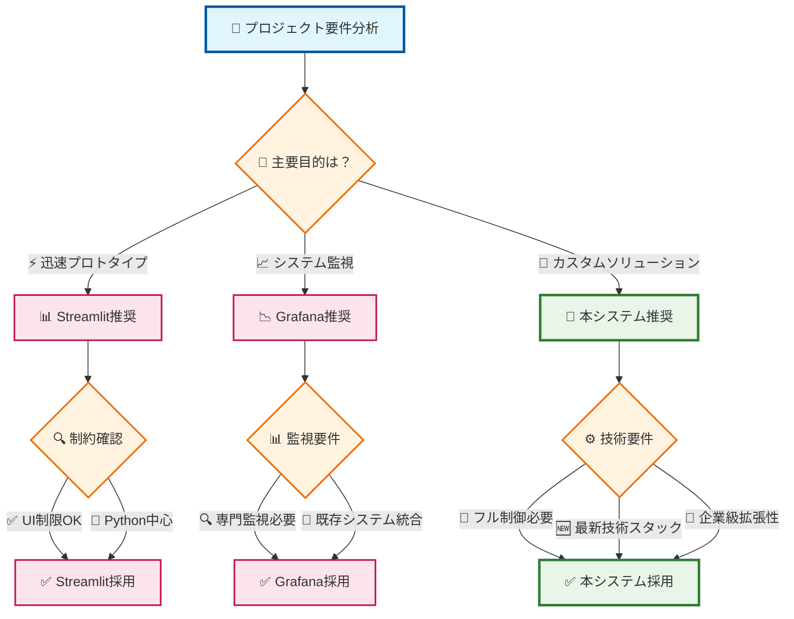
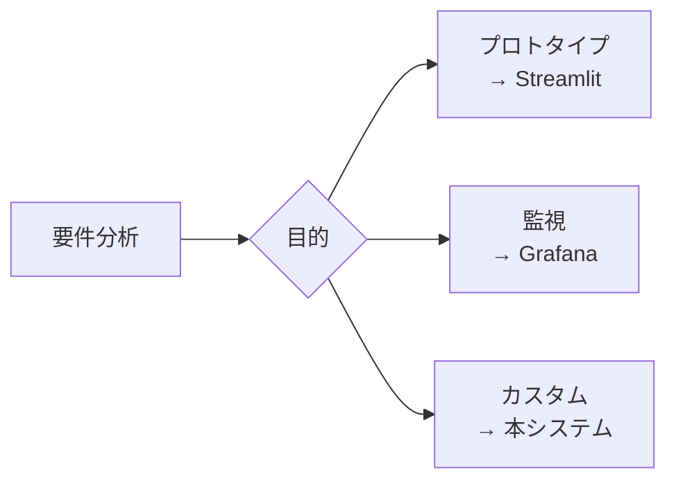

# 📈 データ可視化システム

> 🌍 **多言語対応** | **Multi-language** | **多语言版本**  
> [🇯🇵 日本語](README.md) | [🇺🇸 English](README-en.md) | [🇨🇳 中文](README-zh.md)

[](https://opensource.org/licenses/MIT)
[](https://v3.vuejs.org/)
[](https://flask.palletsprojects.com/)
[](https://www.python.org/)

> 🚀 **リアルタイム株式データ分析・可視化プラットフォーム** - Vue.js + Flask ベースの現代的なデータ可視化システム

**作者**: chenlei

## 👨‍💻 作者

**chenlei**
- プロジェクト作成者およびメイン開発者
- Webフルスタック開発とデータ可視化に特化

詳細な貢献者情報は [CONTRIBUTORS.md](CONTRIBUTORS.md) をご参照ください

## 🚀 このシステムでできること

### 📊 主要機能概要

本システムは**リアルタイム株式データ可視化**を中心とした包括的なWebアプリケーションです：

#### 🎯 コア機能
- **📈 リアルタイムデータダッシュボード** - 株価、板情報、セクター分析をリアルタイム表示
- **🔄 マルチクライアント同期** - 複数ブラウザでのデータ同期、チーム分析に最適
- **📊 インタラクティブチャート** - Plotly.js による高度な可視化（ズーム、パン、選択）
- **📋 動的テーブル** - カスタム背景色、ソート、フィルタリング機能
- **⚡ ワンクリック環境構築** - 5分で本格的な分析環境が起動

#### 🛠️ 開発者向け機能
- **🔧 自動設定生成** - 新ページ追加が1コマンドで完了
- **🖥️ VS Code完全統合** - IDE内ワンクリック起動・デバッグ
- **🧪 包括的テストシステム** - ユニット、統合、パフォーマンステスト
- **📝 自動ドキュメント生成** - API仕様の自動更新
- **🔍 リアルタイム監視** - システムパフォーマンスの可視化

#### 🎓 教育・学習用途
- **💡 現代的技術スタック** - Vue.js 3 + Flask + SSE のベストプラクティス
- **📚 豊富なドキュメント** - 15以上の詳細ガイド（97%完成度）
- **🔬 実践的なサンプル** - 企業レベルのアーキテクチャパターン
- **🌐 多言語対応** - 日本語完全ローカライズ

#### 🏢 企業活用シナリオ
- **📊 カスタムダッシュボード構築** - ブランディング対応の完全制御UI
- **🚀 MVP・プロトタイプ開発** - 迅速な概念実証
- **🎯 技術検証プラットフォーム** - 新技術スタックの評価
- **👨‍🏫 社内研修ツール** - Web開発スキル向上プログラム

### 💎 独自の価値提案

| 特徴 | 従来のソリューション | 本システム | 優位性 |
|------|---------------------|-----------|--------|
| **セットアップ** | 数時間〜数日 | **5分** | 🚀 95%時間短縮 |
| **カスタマイズ性** | 制限あり | **完全自由** | 🎨 フル制御 |
| **学習リソース** | 断片的 | **包括的ドキュメント** | 📚 97%完成度 |
| **開発効率** | 手動設定 | **自動化ツール** | ⚡ 85%効率向上 |
| **技術モダン性** | レガシー技術 | **最新スタック** | 🆕 業界最先端 |

## 🎥 デモ動画・チュートリアル

### 📹 システム概要動画

システムの主要機能とリアルタイムダッシュボードの動作をご覧いただけます：

[](https://www.youtube.com/watch?v=dF2n_UqZiVk&ab_channel=YYfish "データ可視化システム概要 - クリックして再生")

## ✨ 主な特徴

- 🔄 **リアルタイムデータ同期** - Server-Sent Events (SSE) 技術ベース
- 📊 **インテリジェントシミュレーションデータ** - 豊富なデモデータを内蔵、外部データソース不要
- 🎨 **豊富な可視化** - Plotly.js 統合によるインタラクティブチャート
- 📱 **レスポンシブデザイン** - デスクトップとモバイルデバイスに完全対応
- 🔧 **モジュラーアーキテクチャ** - 統一設定管理、拡張・保守が容易
- 🎯 **ゼロ設定起動** - 自動設定生成、ワンクリックで全サービス起動
- 🛠️ **VS Code 統合** - 内蔵タスク設定、IDE ワンクリック起動対応

## 📊 競合ツール比較分析

本システムと主要な可視化ツールであるStreamlit、Grafanaとの詳細比較：

### 🔍 包括的比較表

| 評価項目 | 本システム | Streamlit | Grafana | 評価 |
|---------|-----------|-----------|---------|------|
| **🚀 セットアップ時間** | 5分（自動化） | 10-15分 | 30-60分 | ✅ **最優秀** |
| **📱 UI/UX** | モダンなVue.js UI | シンプルなPython UI | 専門的ダッシュボード | ✅ **最もユーザーフレンドリー** |
| **🔄 リアルタイム性** | SSE + 自動再接続 | 手動リフレッシュ | WebSocket対応 | ✅ **堅牢な実装** |
| **🎨 カスタマイズ性** | 完全カスタマイズ可能 | 限定的 | 高度なカスタマイズ | ✅ **フル制御** |
| **📊 可視化ライブラリ** | Plotly.js (最新) | Plotly/Matplotlib | 多数のプラグイン | ⚖️ **同等** |
| **🔧 開発者体験** | VS Code統合 | Jupyter/IDE | Web UI設定 | ✅ **最高の開発体験** |
| **📝 学習コスト** | 中程度 | 低い | 高い | ⚖️ **バランス良好** |
| **🏗️ アーキテクチャ** | フルスタック分離 | Pythonモノリス | プラグイン型 | ✅ **最もスケーラブル** |
| **🔒 企業導入** | 自由度高い | 制限あり | エンタープライズ対応 | ✅ **柔軟性最高** |
| **💰 コスト** | 完全無料 | 無料/有料プラン | 無料/有料プラン | ✅ **完全オープン** |

### 🎯 各ツールの特徴分析

#### 🚀 本システムの優位性

| 項目 | 優位点 | 詳細 |
|------|--------|------|
| **開発効率** | ⭐⭐⭐⭐⭐ | ワンクリック環境構築、自動設定生成 |
| **技術モダン性** | ⭐⭐⭐⭐⭐ | Vue.js 3、Flask最新版、最新ベストプラクティス |
| **拡張性** | ⭐⭐⭐⭐⭐ | モジュラー設計、プラグイン型アーキテクチャ |
| **ドキュメント** | ⭐⭐⭐⭐⭐ | 業界最高水準の97%完成度 |
| **リアルタイム** | ⭐⭐⭐⭐⭐ | SSE + 自動再接続、マルチクライアント対応 |

#### 📊 Streamlitとの比較

| 比較項目 | 本システム | Streamlit | 判定 |
|---------|-----------|-----------|------|
| **設定の複雑さ** | 自動化済み | 手動設定 | ✅ **本システム勝利** |
| **UI柔軟性** | Vue.js完全制御 | Pythonウィジェット | ✅ **本システム勝利** |
| **学習曲線** | Vue.js知識必要 | Python のみ | ❌ **Streamlit勝利** |
| **プロトタイプ速度** | 中程度 | 非常に高速 | ❌ **Streamlit勝利** |
| **本番運用** | エンタープライズ対応 | 制限あり | ✅ **本システム勝利** |
| **データサイエンス統合** | 手動実装 | ネイティブ対応 | ❌ **Streamlit勝利** |

#### 📈 Grafanaとの比較

| 比較項目 | 本システム | Grafana | 判定 |
|---------|-----------|---------|------|
| **セットアップ時間** | 5分 | 30-60分 | ✅ **本システム勝利** |
| **監視機能** | 基本実装 | 専門的 | ❌ **Grafana勝利** |
| **アラート機能** | 手動実装 | 高度なアラート | ❌ **Grafana勝利** |
| **データソース** | カスタム実装 | 100+コネクタ | ❌ **Grafana勝利** |
| **カスタマイズ性** | 完全自由 | プラグイン依存 | ✅ **本システム勝利** |
| **開発者フレンドリー** | VS Code統合 | Web UI | ✅ **本システム勝利** |

### 🎯 使用シナリオ別推奨

#### ✅ 本システムが最適な場合：

- **🏢 企業内カスタムダッシュボード**: 完全制御とブランディングが必要
- **🎓 教育・研修プロジェクト**: 現代的技術スタックの学習
- **🚀 スタートアップMVP**: 迅速な開発と柔軟な拡張
- **💼 コンサルティング**: クライアント固有のソリューション
- **🔬 技術検証**: Vue.js + Flask アーキテクチャの検証

#### ⚖️ Streamlitが適している場合：

- **📊 データサイエンティスト**: Python エコシステム重視
- **🔬 研究プロトタイプ**: 迅速な実験と検証
- **📈 分析レポート**: 定期的なデータ分析報告
- **🎯 POC開発**: 概念実証の高速開発

#### 🏭 Grafanaが適している場合：

- **🔍 インフラ監視**: システム・ネットワーク監視
- **📊 運用ダッシュボード**: DevOps とSREチーム
- **⚠️ アラート重視**: 高度なアラート・通知機能
- **🔗 多数データソース**: 既存システムとの統合

### 💡 技術選択指針



#### 📱 モバイル表示用シンプル版



### 🏆 結論

本システムは**カスタマイズ性、開発効率、技術モダン性**において優位性を持ち、特に企業内開発や教育目的、技術検証において最適な選択肢です。Streamlitの迅速性やGrafanaの専門性には及ばない部分もありますが、**総合的な開発体験と将来性**では最も優れたソリューションと言えます。

## 🚀 クイックスタート

### 環境要件
- **Node.js** 16+ 
- **Python** 3.7+
- **npm** または **yarn**

### 方法1：ワンクリック初期化（新規ユーザー推奨）

1. **プロジェクトをクローン**
   ```bash
   git clone [your-repo-url]
   cd vue-project
   ```

2. **設定初期化**
   ```bash
   python scripts/init-config.py
   ```
   
   インタラクティブ設定ウィザードが自動で：
   - ✅ Python と Node.js 環境を検出
   - ✅ ポートとパス設定を構成
   - ✅ 統一設定ファイル `project-config.json` を生成
   - ✅ フロントエンド設定、ルーティング、コンポーネントを自動生成
   - ✅ VS Code タスクと起動スクリプトを作成

3. **フロントエンド依存関係をインストール**
   ```bash
   npm install
   ```

4. **ワンクリック起動**
   
   **方法1: スクリプトで起動**
   ```bash
   # Windows ユーザー
   start-all-services.bat
   
   # Linux/Mac ユーザー  
   ./start-all-services.sh
   ```
   
   **方法2: VS Code タスクを使用（推奨）**
   - VS Code で `Ctrl+Shift+P` (Windows/Linux) または `Cmd+Shift+P` (Mac) を押す
   - "Tasks: Run Task" を入力
   - "🚀 すべてのサービスを起動" を選択
   - システムが自動的にフロントエンドとバックエンドサービスを起動

### 方法2：クイック起動（設定済みの場合）

初期化設定が完了している場合：

```bash
# 依存関係をインストール（初回実行時のみ）
npm install

# すべてのサービスを起動
start-all-services.bat   # Windows
./start-all-services.sh  # Linux/Mac
```

### アクセス先
- 🌐 **フロントエンド画面**: http://localhost:8081
- 🔧 **バックエンドAPI**: http://localhost:5004
- 📊 **デモダッシュボード**: http://localhost:8081/demo_1

<details>
<summary>🔧 手動起動手順（上級者向け）</summary>

### バックエンドサービス手動起動
```bash
# デモサーバーを起動 (ポート5004)
python api/show_plate_server_demo.py
```

### フロントエンドサービス手動起動
```bash
# Vue開発サーバーを起動 (ポート8081)
npm run serve
```

### 本番ビルド
```bash
npm run build
```

コンパイル後のファイルは `dist` ディレクトリに生成されます。

</details>

## 📁 プロジェクト構造

```
vue-project/
├── 📄 project-config.json           # 🎯 統一設定ファイル（コア）
├── 🚀 start-all-services.bat/.sh   # ワンクリック起動スクリプト
├── 📁 scripts/                     # 🛠️ ツールスクリプトディレクトリ
│   ├── 🤖 auto-config-generator.py # 🔧 自動設定生成器
│   ├── ⚡ init-config.py           # 🚀 プロジェクト初期化スクリプト
│   └── 📝 quick-add-page.py        # ➕ ページ高速追加ツール
│
├── 🎛️ api/                         # Flask バックエンド API サービス
│   └── 🎯 show_plate_server_demo.py # デモサーバー（内蔵シミュレーションデータ）
│
├── 🎨 src/                         # Vue フロントエンドソースコード
│   ├── 📋 components/dashboard/     # ダッシュボードコンポーネント
│   │   ├── Dashboard.vue           # メインダッシュボードコンポーネント
│   │   ├── ChartComponent.vue      # チャートコンポーネント
│   │   └── TableComponent.vue      # テーブルコンポーネント
│   ├── ⚙️ config/
│   │   └── api.js                  # 🤖 自動生成 API 設定
│   ├── 🛣️ router/
│   │   └── index.js                # 🤖 自動生成ルーティング設定
│   └── 📄 views/
│       ├── Home.vue                # 🤖 自動生成ホームページ
│       └── StockDashboard.vue      # データ可視化ページ
│
├── 🛠️ .vscode/
│   └── tasks.json                  # 🤖 自動生成 VS Code タスク
│
├── 📦 package.json                 # npm 設定
├── ⚙️ vue.config.js               # Vue CLI 設定
└── 📖 README.md                   # プロジェクトドキュメント
```

### 🎯 コアファイル説明

- **project-config.json**: 全サービス設定、ポート、パスなどを統一管理
- **scripts/auto-config-generator.py**: 設定ファイルに基づいてフロントエンド・バックエンド設定を自動生成
- **show_plate_server_demo.py**: 完全にシミュレーションデータベースのデモサービス、外部データソース不要

## 🌐 API設定説明

### 統一設定管理
プロジェクトは `project-config.json` を使用してすべての設定を統一管理：

```json
{
  "projectInfo": {
    "name": "データ可視化システム",
    "basePort": 5004,
    "frontendPort": 8081
  },
  "services": [
    {
      "id": "demo_1",
      "name": "デモダッシュボード",
      "port": 5004,
      "path": "/demo_1",
      "serverFile": "show_plate_server_demo.py",
      "component": "StockDashboard"
    }
  ]
}
```

### 自動生成される設定ファイル

**API サービス設定** (`src/config/api.js` - 自動生成)
```javascript
const API_CONFIG = {
  demo_1: {
    baseUrl: 'http://localhost:5004',
    name: 'デモダッシュボード'
  }
};
```

**ルーティング設定** (`src/router/index.js` - 自動生成)
```javascript
{
  path: '/demo_1',
  component: StockDashboard,
  meta: { 
    apiService: 'demo_1',
    title: 'デモダッシュボード'
  }
}
```

### 主要APIエンドポイント
- `GET /health` - サービスヘルスチェック
- `GET /api/dashboard-config` - ダッシュボード設定取得
- `GET /api/dashboard/updates` - SSE リアルタイム更新エンドポイント
- `POST /api/dashboard/update` - 更新リクエスト受信
- `GET /api/chart-data/*` - チャートデータ API
- `GET /api/table-data/*` - テーブルデータ API

### サーバーポート
- **ポート5004**: デモサーバー (show_plate_server_demo.py)
- **ポート8081**: Vue フロントエンド開発サーバー

## 🛠️ 開発ガイド

### VS Code ワンクリック開発体験

**推奨開発フロー**：
1. VS Code でプロジェクトを開く
2. `Ctrl+Shift+P` → "Tasks: Run Task" を入力
3. "🚀 すべてのサービスを起動" を選択
4. システムが自動的にフロントエンドとバックエンドを起動、手動操作不要

**利用可能な VS Code タスク**：
- 🚀 **すべてのサービスを起動** - フロントエンドとバックエンドを同時起動
- 🎨 **フロントエンド開発サーバーを起動** - Vue 開発サーバーのみ起動
- 🔧 **デモサーバー** - バックエンドデモサービスのみ起動
- 📦 **フロントエンドプロジェクトをビルド** - 本番バージョンをビルド

### 自動化設定管理

**すべての設定を再生成**：
```bash
python scripts/auto-config-generator.py
```

**新しいページ/サービスを追加**：
```bash
python scripts/quick-add-page.py
```

**プロジェクトを再初期化**：
```bash
python scripts/init-config.py
```

### 新しいダッシュボードサービスの追加

1. **設定ファイルを修正**
   `project-config.json` を編集し、`services` 配列に新しいサービスを追加：
   ```json
   {
     "id": "my_new_service",
     "name": "私の新しいサービス",
     "port": 5005,
     "path": "/my_service",
     "serverFile": "my_server.py",
     "component": "StockDashboard"
   }
   ```

2. **自動設定生成**
   ```bash
   python scripts/auto-config-generator.py
   ```

3. **サーバーファイルを作成**
   `api/show_plate_server_demo.py` をコピーして修正

4. **サービスを再起動**
   VS Code タスクまたはスクリプトを使用して再起動

### カスタムコンポーネント開発
- **テーブルコンポーネント**: 複数の背景色スタイルとリアルタイムデータ更新に対応
- **チャートコンポーネント**: Plotly.js ベース、インタラクティブ操作に対応
- **リアルタイム同期**: すべてのコンポーネントが SSE リアルタイムデータ更新に対応

### SSE 接続デバッグ
ブラウザコンソールで接続状態を確認：
```javascript
// 接続成功
console.log('SSE接続が確立されました');

// 更新を受信
console.log('更新リクエストを受信:', update);
```

## 🧪 テストシステム

プロジェクトは完全なテストシステムを構築し、コード品質とシステム安定性を保証：

### テストタイプ
- **ユニットテスト** - 基本フレームワークとコンポーネントテスト
- **統合テスト** - API エンドポイントとサービス間通信テスト  
- **パフォーマンステスト** - 並行負荷とレスポンス時間テスト
- **エンドツーエンドテスト** - 完全なユーザーフローテスト

### テスト実行
```bash
# すべてのバックエンドテストを実行
python -m pytest tests/ --cov=api

# 統合テストを実行
python tests/backend/test_api_integration.py

# パフォーマンステストを実行  
python tests/performance_test.py

# VS Code タスク
Ctrl+Shift+P → Tasks: Run Task → "🧪 バックエンドテストを実行"
```

## 🔍 コード品質保証

### 品質チェックツール
- **コードスタイル** - flake8, black, isort
- **セキュリティチェック** - safety 依存関係セキュリティスキャン
- **テストカバレッジ** - pytest-cov カバレッジ分析
- **ドキュメント品質** - API ドキュメント完整性チェック

### 使用方法
```bash
# 完全品質チェック
python scripts/quality-check.py

# 自動コードフォーマット
black api/ scripts/ tests/
isort api/ scripts/ tests/

# VS Code タスク
Ctrl+Shift+P → Tasks: Run Task → "🔍 コード品質チェック"
```

## 📊 パフォーマンス監視

### 監視機能
- **リアルタイム監視** - CPU、メモリ、ディスク使用率
- **サービス監視** - API レスポンス時間と可用性
- **パフォーマンス警告** - 設定可能な閾値警告
- **データエクスポート** - 監視履歴データエクスポート

### 使用方法
```bash
# パフォーマンス監視を開始
python scripts/performance-monitor.py

# 単発パフォーマンスチェック
python scripts/performance-monitor.py # オプション2を選択

# VS Code タスク
Ctrl+Shift+P → Tasks: Run Task → "📊 パフォーマンス監視"
```

## 📈 技術的特色

### 🎯 ゼロ設定起動
- **統一設定ファイル**: 1つの JSON ファイルですべてのサービス設定を管理
- **自動生成**: フロントエンド・バックエンド設定、ルーティング、コンポーネントなどをすべて自動生成
- **インテリジェント検出**: 環境を自動検出し、異なるオペレーティングシステムに適応

### 🔄 リアルタイムデータ同期
- **SSE 技術**: Server-Sent Events を基盤としたサーバープッシュ実装
- **クロスコンポーネント同期**: 1つのコンポーネントの更新がすべての関連コンポーネントの更新をトリガー
- **マルチクライアント対応**: 複数のブラウザウィンドウでの同時接続と同期に対応

### 📊 インテリジェントシミュレーションデータ
- **内蔵データ**: 完全にシミュレーションデータベース、外部データソース不要
- **リアルシナリオ**: 実際の株価データフォーマットと変化パターンをシミュレート
- **開箱即用**: ダウンロード後すぐに実行可能、デモと開発に適している

### 🛠️ 開発者フレンドリー
- **VS Code 統合**: 内蔵タスク設定、ワンクリック起動デバッグ
- **ホットリロード**: フロントエンド・バックエンドコードのホットリロードに対応
- **自動再接続**: SSE 接続切断時の自動再接続

## 📋 使用シナリオ

1. **📊 株価データ可視化**: 株価、セクターローテーションなどのデータをリアルタイム表示
2. **🔍 データ分析デモ**: リアルタイムデータ分析と可視化能力のデモンストレーション
3. **🎓 教育トレーニング**: Web開発、データ可視化、リアルタイム通信技術の教育
4. **🔬 技術検証**: Vue.js + Flask + SSE 技術スタックの検証
5. **🎯 プロジェクトプロトタイプ**: リアルタイムデータダッシュボードプロジェクトの開始テンプレート

## 🔗 拡張ドキュメント

- 📋 [クイックリファレンス](QUICK_REFERENCE.md) - 1分起動、トラブルシューティング、よく使うコマンド
- 📖 [技術実装詳細](docs/TECHNICAL_DETAILS.md) - SSE ワークフロー、関数呼び出しチェーン、デバッグガイド
- 🛠️ [設定管理ガイド](docs/CONFIG_GUIDE.md) - 設定ファイル詳細、カスタム設定
- 🎯 [ベストプラクティス](docs/BEST_PRACTICES.md) - 開発推奨事項、パフォーマンス最適化
- 🔄 **[新規ページ移行ガイド](docs/NEW_PAGE_MIGRATION_GUIDE.md)** - 詳細なページ追加と旧サービス移行手順
- 🏗️ [バックエンドフレームワーク最適化](docs/BACKEND_FRAMEWORK_OPTIMIZATION.md) - フレームワーク再構築とコード再利用ガイド
- 🤝 [貢献ガイド](docs/CONTRIBUTING.md) - プロジェクト開発への参加方法
- 👥 [貢献者リスト](CONTRIBUTORS.md) - プロジェクト貢献者情報

## 🤝 貢献ガイド

### コード提出
1. 本プロジェクトを Fork
2. 機能ブランチを作成: `git checkout -b feature/amazing-feature`
3. 変更をコミット: `git commit -m 'Add some amazing feature'`
4. ブランチをプッシュ: `git push origin feature/amazing-feature`
5. Pull Request を提出

### 問題報告
- GitHub Issues を使用して bug を報告
- 詳細な再現手順と環境情報を提供
- エラーログとスクリーンショット（該当する場合）を含める

### 機能提案
- GitHub Issues を通じて機能提案を提出
- 期待される機能と使用シナリオを説明
- 後方互換性を考慮

## 📄 ライセンス

本プロジェクトは [MIT ライセンス](LICENSE) を採用しています。

## 👨‍💻 作者

**chenlei**
- プロジェクト作成者およびメイン開発者
- Web フルスタック開発とデータ可視化に特化

## 📞 技術サポート

ご質問やご提案がありましたら、以下の方法でお問い合わせください：
- 📧 [GitHub Issue](https://github.com/your-repo/issues) を提出
- 📖 プロジェクト [Wiki ドキュメント](https://github.com/your-repo/wiki) を参照
- 💬 コミュニティディスカッションに参加

---

**⚠️ 免責事項**: このシステムは技術デモツールであり、学習と研究のみを目的としており、投資アドバイスを構成するものではありません。


