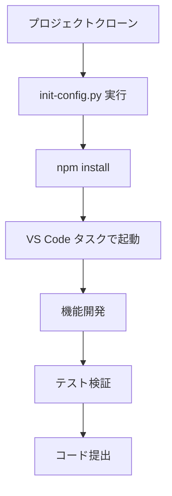
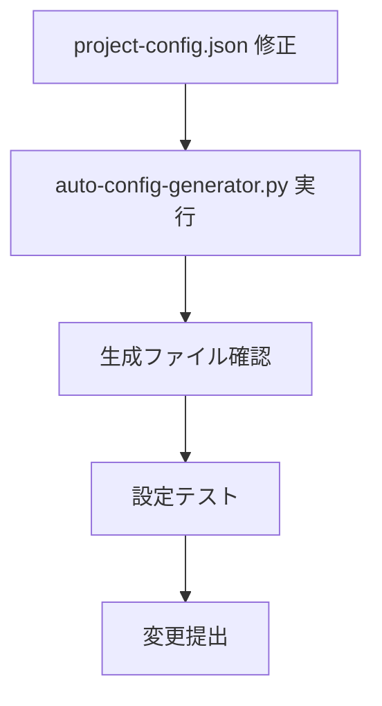

# 🎯 ベストプラクティスガイド

**作成者**: chenlei

## 🏗️ プロジェクト開発ベストプラクティス

### 📁 ディレクトリ構造規範

```
vue-project/
├── 📄 project-config.json      # 唯一の設定ソース、バージョン管理
├── 🤖 auto-config-generator.py # 自動化ツール、バージョン管理
├── 🔧 ツールスクリプト/           # バージョン管理
│   ├── init-config.py
│   └── quick-add-page.py
├── 🎛️ api/                    # バックエンドサービス、バージョン管理
├── 🎨 src/                    # フロントエンドソースコード
│   ├── components/            # 再利用可能コンポーネント、バージョン管理
│   ├── views/                 # ページコンポーネント、バージョン管理
│   ├── utils/                 # ユーティリティ関数、バージョン管理
│   ├── config/ (自動生成)      # 手動修正禁止
│   └── router/ (自動生成)      # 手動修正禁止
├── 🛠️ .vscode/ (自動生成)     # バージョン管理選択可能
├── 📋 backup/                 # 自動バックアップ、バージョン管理対象外
└── 📦 node_modules/           # 依存関係ディレクトリ、バージョン管理対象外
```

### 🔄 開発ワークフロー

#### 1. 標準開発フロー


#### 2. 設定変更フロー


### 🎨 フロントエンド開発規範

#### Vue コンポーネント規範

**1. コンポーネントファイル命名**
```
PascalCase.vue        # 推奨：StockDashboard.vue
kebab-case.vue        # オプション：stock-dashboard.vue
```

**2. コンポーネント構造**
```vue
<template>
  <!-- テンプレート部分 -->
</template>

<script>
// スクリプト部分
export default {
  name: 'ComponentName',
  props: {
    // プロパティ定義
  },
  data() {
    return {
      // 響応データ
    }
  },
  methods: {
    // メソッド定義
  }
}
</script>

<style scoped>
/* スタイル部分 */
</style>
```

**3. コンポーネント通信ベストプラクティス**
```javascript
// Props でデータを渡す（親→子）
props: {
  componentConfig: {
    type: Object,
    required: true
  }
}

// Events でイベントを渡す（子→親）
this.$emit('update-data', newData)

// グローバルイベントバス（コンポーネント間）
window.dispatchEvent(new CustomEvent('dashboard-update', {
  detail: updateData
}))
```

#### API 呼び出し規範

**1. 統一された API 設定**
```javascript
// 自動生成された API 設定を使用
import { API_CONFIG } from '@/config/api'

// API ベース URL を取得
const baseUrl = API_CONFIG[serviceId]?.baseUrl
```

**2. エラー処理**
```javascript
async function fetchData(url) {
  try {
    const response = await axios.get(url)
    return response.data
  } catch (error) {
    console.error('API リクエスト失敗:', error)
    // ユーザーフレンドリーなエラー表示
    this.showError('データ読み込み失敗、再試行してください')
    return null
  }
}
```

**3. ローディング状態管理**
```javascript
data() {
  return {
    loading: false,
    error: null,
    data: null
  }
}

async methods: {
  async loadData() {
    this.loading = true
    this.error = null
    
    try {
      this.data = await fetchData(this.apiUrl)
    } catch (error) {
      this.error = error.message
    } finally {
      this.loading = false
    }
  }
}
```

### 🔧 バックエンド開発規範

#### Flask サービス規範

**1. サービスファイル構造**
```python
# 依存関係インポート
from flask import Flask, jsonify, request
from flask_cors import CORS
import random
import time

# アプリケーション作成
app = Flask(__name__)
CORS(app)

# 設定定数
PORT = 5004
DEBUG_MODE = True

# ルート定義
@app.route('/health')
def health_check():
    return jsonify({"status": "healthy", "timestamp": time.time()})

@app.route('/api/dashboard-config')
def get_dashboard_config():
    # 実装ロジック
    pass

# サービス開始
if __name__ == '__main__':
    app.run(host='0.0.0.0', port=PORT, debug=DEBUG_MODE)
```

**2. API レスポンス形式**
```python
# 成功レスポンス
{
  "status": "success",
  "data": {
    "columns": [...],
    "rows": [...]
  },
  "timestamp": 1641234567.89
}

# エラーレスポンス
{
  "status": "error",
  "message": "具体的なエラー情報",
  "code": "ERROR_CODE",
  "timestamp": 1641234567.89
}
```

**3. データモック規範**
```python
def generate_mock_data(count=20):
    """モックデータ生成"""
    data = []
    for i in range(count):
        item = {
            'id': f'stock_{i:03d}',
            'name': f'株式{i+1:03d}',
            'price': round(random.uniform(10, 200), 2),
            'change': round(random.uniform(-10, 10), 2)
        }
        data.append(item)
    return data
```

### 📊 データ可視化ベストプラクティス

#### 背景色関数開発

**1. 関数命名規範**
```javascript
// 機能説明的命名
heatmap          // ヒートマップ
redGreen         // 赤緑色階
technicalAnalysis // 技術分析
priceRange       // 価格区間
```

**2. 関数パラメータ標準**
```javascript
function customFunction(value, column, row, allRows) {
  // value: 現在のセル値
  // column: 列設定オブジェクト
  // row: 現在の行データ
  // allRows: すべての行データ
  
  // CSS背景色文字列を返す
  return 'rgba(255, 0, 0, 0.5)'
}
```

**3. 色値規範**
```javascript
// RGBA 形式を使用、透明度制御が便利
'rgba(255, 0, 0, 0.5)'    // 半透明赤色
'rgba(0, 255, 0, 0.3)'    // 薄緑色
'rgba(0, 0, 255, 0.8)'    // 濃青色

// 透明度をサポートしない形式の使用を避ける
'#ff0000'                 // 非推奨
'red'                     // 非推奨
```

### 🚀 パフォーマンス最適化

#### フロントエンドパフォーマンス最適化

**1. コンポーネント遅延ロード**
```javascript
const StockDashboard = () => import('@/views/StockDashboard.vue')
```

**2. データキャッシュ**
```javascript
// Vue の計算プロパティキャッシュを使用
computed: {
  processedData() {
    // 複雑な計算がキャッシュされる
    return this.rawData.map(item => {
      return {
        ...item,
        processed: expensiveOperation(item)
      }
    })
  }
}
```

**3. イベントデバウンス**
```javascript
import { debounce } from 'lodash'

methods: {
  onSearch: debounce(function(query) {
    this.performSearch(query)
  }, 300)
}
```

#### バックエンドパフォーマンス最適化

**1. データ前処理**
```python
# アプリケーション起動時にデータを事前生成
mock_data = generate_large_dataset()

@app.route('/api/data')
def get_data():
    # 前処理されたデータを直接返す
    return jsonify(mock_data)
```

**2. レスポンス圧縮**
```python
from flask_compress import Compress

app = Flask(__name__)
Compress(app)  # 自動レスポンス圧縮
```

### 🔍 デバッグとテスト

#### デバッグ技法

**1. フロントエンドデバッグ**
```javascript
// 重要な箇所にデバッグ情報を追加
console.group('API 呼び出し')
console.log('リクエスト URL:', url)
console.log('リクエストパラメータ:', params)
console.log('レスポンスデータ:', response)
console.groupEnd()

// Vue DevTools を使用
this.$nextTick(() => {
  console.log('DOM 更新完了')
})
```

**2. バックエンドデバッグ**
```python
import logging

# ログレベル設定
logging.basicConfig(level=logging.DEBUG)

@app.route('/api/data')
def get_data():
    logging.info(f'リクエスト受信: {request.method} {request.path}')
    # ビジネスロジック
    logging.debug(f'返却データ件数: {len(data)}')
    return jsonify(data)
```

#### テスト戦略

**1. フロントエンドテスト**
```javascript
// コンポーネント単体テスト
import { mount } from '@vue/test-utils'
import StockDashboard from '@/views/StockDashboard.vue'

test('コンポーネント正常レンダリング', () => {
  const wrapper = mount(StockDashboard, {
    props: {
      config: mockConfig
    }
  })
  expect(wrapper.find('.dashboard').exists()).toBe(true)
})
```

**2. API テスト**
```python
import unittest
import json

class APITestCase(unittest.TestCase):
    def setUp(self):
        self.app = app.test_client()
    
    def test_health_check(self):
        response = self.app.get('/health')
        self.assertEqual(response.status_code, 200)
        data = json.loads(response.data)
        self.assertEqual(data['status'], 'healthy')
```

### 🔒 セキュリティベストプラクティス

#### フロントエンドセキュリティ

**1. 入力検証**
```javascript
// ユーザー入力検証
function validateInput(value) {
  if (!value || typeof value !== 'string') {
    return false
  }
  // XSS 攻撃を防ぐ
  return !/<script|javascript:/i.test(value)
}
```

**2. 機密データ処理**
```javascript
// フロントエンドに機密情報を保存しない
// HTTPS を使用して送信
// API レスポンス形式を検証
```

#### バックエンドセキュリティ

**1. リクエスト検証**
```python
from flask import request
import re

@app.before_request
def validate_request():
    # リクエスト元検証
    if request.method == 'POST':
        content_type = request.headers.get('Content-Type', '')
        if 'application/json' not in content_type:
            return jsonify({'error': 'Invalid content type'}), 400
```

**2. CORS 設定**
```python
from flask_cors import CORS

# 本番環境では許可ドメインを制限
CORS(app, origins=['http://localhost:8081'])
```

### 📚 ドキュメント保守

#### コード注釈規範

**1. 関数注釈**
```javascript
/**
 * 株式技術分析スコア計算
 * @param {number} value - 現在値
 * @param {Object} column - 列設定
 * @param {Object} row - 行データ
 * @param {Array} allRows - すべてのデータ
 * @returns {string} CSS 背景色
 */
function technicalAnalysis(value, column, row, allRows) {
  // 実装ロジック
}
```

**2. 複雑ロジック注釈**
```javascript
// RSI スコア計算 (0-100)
// RSI > 70: 買われすぎ状態、スコア低め
// RSI < 30: 売られすぎ状態、スコア高め
// RSI 30-70: 正常状態、スコア中程度
const rsiScore = calculateRsiScore(row.rsi)
```

#### ドキュメント更新フロー

1. **コード変更時にドキュメントを同期更新**
2. **Markdown 形式で技術ドキュメントを作成**
3. **定期的に古いドキュメントを見直し更新**
4. **変更ログとバージョン説明を維持**
