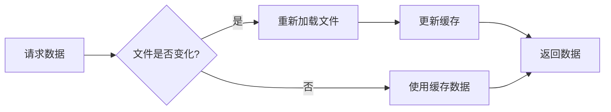
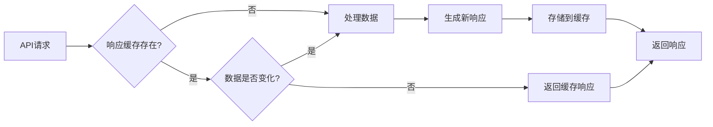

# 📊 data_panel框架数据缓存功能实现指南

> **文档版本**: v2.0  
> **最后更新**: 2025年8月1日  
> **作者**: data_panel开发团队

## 📋 目录

- [📖 概述](#-概述)
- [🏗️ 项目架构](#️-项目架构)
- [🚀 缓存系统原理](#-缓存系统原理)
- [📝 实施步骤](#-实施步骤)
- [💡 高级用法](#-高级用法)
- [🔧 配置参考](#-配置参考)
- [🎯 最佳实践](#-最佳实践)
- [🐛 常见问题](#-常见问题)

## 📖 概述

data_panel是一个基于**Vue.js + Flask**的网页数据显示框架，通过配置文件可以快速搭建数据可视化页面。本文档详细介绍如何使用框架的数据缓存功能来提升性能。

### 🎯 缓存系统特点

- **双层缓存**: 数据缓存 + 响应缓存
- **智能更新**: 基于文件时间戳和数据哈希的自动失效
- **内存管理**: LRU算法自动清理，防止内存溢出
- **参数区分**: 支持基于请求参数的缓存隔离

## 🏗️ 项目架构

```
data_panel/
├── 📁 api/                    # 后端API服务
│   ├── 📁 conf/              # 配置文件目录
│   │   ├── server_config.py  # 服务器配置
│   │   └── component_config.py # 组件配置
│   ├── 📁 processors/        # 数据处理器
│   │   ├── base_processor.py # 处理器基类
│   │   ├── demo_processor.py # 示例处理器
│   │   └── your_processor.py # 自定义处理器
│   └── 📁 server/            # 服务器基类和实现
│       ├── base_server.py    # 服务器基类（包含缓存）
│       └── demo_server.py    # 示例服务器
├── 📁 src/                   # 前端Vue.js源码
│   ├── 📁 components/        # Vue组件
│   └── 📁 views/             # 页面视图
├── 📄 project-config.json    # 项目主配置文件
└── 📄 package.json          # 前端依赖配置
```

## 🚀 缓存系统原理

### 1️⃣ 数据缓存 (BaseDataCache)

**位置**: `api/server/base_server.py:BaseDataCache`

**功能**:
- 缓存从CSV文件或数据库加载的原始数据
- 监控文件修改时间，自动重新加载变化的数据
- 提供内存缓存，避免重复I/O操作

**工作流程**:


### 2️⃣ 响应缓存 (BaseResponseCache)

**位置**: `api/server/base_server.py:BaseResponseCache`

**功能**:
- 缓存API接口的完整响应结果
- 通过数据哈希值判断是否需要重新计算
- LRU算法管理缓存大小

**工作流程**:


## 📝 实施步骤

### 步骤1: 创建数据处理器

在 `api/processors/` 目录下创建新的处理器文件：

**文件**: `api/processors/your_table_processor.py`

```python
"""
自定义表格数据处理器
演示如何使用数据缓存功能
"""
from .base_processor import BaseDataProcessor
from flask import jsonify
import pandas as pd
from typing import Dict, Any


class YourTableProcessor(BaseDataProcessor):
    """自定义表格处理器 - 展示缓存功能的完整实现"""
    
    def process_custom_table_data(self):
        """
        处理自定义表格数据
        
        展示完整的缓存使用流程：
        1. 数据加载（自动使用数据缓存）
        2. 响应缓存检查
        3. 数据处理
        4. 响应缓存存储
        """
        try:
            self.logger.info("开始处理自定义表格数据")
            
            # ===== 步骤1: 加载数据（自动使用数据缓存） =====
            df = self.data_cache.load_data('custom_table_df')
            
            if df.empty:
                return self.error_response("数据文件不存在或为空", 404)
            
            # ===== 步骤2: 构建缓存键和参数 =====
            cache_endpoint = '/api/table-data/custom_table'
            cache_params = self.build_cache_params()  # 自动获取URL参数
            
            # ===== 步骤3: 构建源数据标识（用于检测数据变化） =====
            source_data = {
                'data_count': len(df),
                'data_columns': list(df.columns),
                'last_update': df['update_time'].max() if 'update_time' in df.columns else None,
                'file_timestamp': self.data_cache.timestamps.get('custom_table_df', 0)
            }
            
            # ===== 步骤4: 检查响应缓存 =====
            should_cache, cached_response = self.should_use_cache(
                cache_endpoint, cache_params, source_data
            )
            
            if should_cache and cached_response:
                self.logger.info("✅ 使用缓存数据返回表格")
                return cached_response
            
            # ===== 步骤5: 处理数据（缓存未命中时） =====
            self.logger.info("🔄 缓存未命中，开始处理数据")
            processed_data = self._process_table_data(df, cache_params)
            
            # ===== 步骤6: 构建响应 =====
            response_data = jsonify({
                "success": True,
                "data": processed_data['records'],
                "pagination": {
                    "total": processed_data['total'],
                    "page": cache_params.get('page', 1),
                    "pageSize": cache_params.get('pageSize', 20),
                    "hasMore": processed_data['has_more']
                },
                "metadata": {
                    "columns": processed_data['columns'],
                    "updateTime": source_data['last_update'],
                    "cached": False
                },
                "message": "数据加载成功"
            })
            
            # ===== 步骤7: 存储到响应缓存 =====
            self.store_cache(cache_endpoint, cache_params, source_data, response_data)
            self.logger.info("💾 响应已存储到缓存")
            
            return response_data
            
        except Exception as e:
            self.logger.error(f"处理表格数据失败: {e}")
            return self.error_response(f"处理表格数据失败: {e}")
    
    def _process_table_data(self, df: pd.DataFrame, params: Dict[str, Any]) -> Dict[str, Any]:
        """
        具体的数据处理逻辑
        
        Args:
            df: 原始数据DataFrame
            params: 请求参数
            
        Returns:
            处理后的数据字典
        """
        # 获取分页参数
        page = int(params.get('page', 1))
        page_size = int(params.get('pageSize', 20))
        
        # 获取排序参数
        sort_field = params.get('sortField', None)
        sort_order = params.get('sortOrder', 'asc')
        
        # 获取筛选参数
        filters = params.get('filters', {})
        
        # 数据筛选
        filtered_df = self._apply_filters(df, filters)
        
        # 数据排序
        if sort_field and sort_field in filtered_df.columns:
            ascending = sort_order.lower() == 'asc'
            filtered_df = filtered_df.sort_values(sort_field, ascending=ascending)
        
        # 计算总数
        total = len(filtered_df)
        
        # 分页处理
        start_idx = (page - 1) * page_size
        end_idx = start_idx + page_size
        page_df = filtered_df.iloc[start_idx:end_idx]
        
        # 转换为前端所需格式
        records = page_df.to_dict('records')
        
        # 处理数值格式化
        for record in records:
            for key, value in record.items():
                if pd.isna(value):
                    record[key] = None
                elif isinstance(value, (int, float)):
                    record[key] = round(value, 4) if isinstance(value, float) else value
        
        return {
            'records': records,
            'total': total,
            'has_more': end_idx < total,
            'columns': list(filtered_df.columns)
        }
    
    def _apply_filters(self, df: pd.DataFrame, filters: Dict[str, Any]) -> pd.DataFrame:
        """应用数据筛选"""
        filtered_df = df.copy()
        
        for field, filter_value in filters.items():
            if field not in df.columns:
                continue
                
            if isinstance(filter_value, dict):
                # 范围筛选
                if 'min' in filter_value and filter_value['min'] is not None:
                    filtered_df = filtered_df[filtered_df[field] >= filter_value['min']]
                if 'max' in filter_value and filter_value['max'] is not None:
                    filtered_df = filtered_df[filtered_df[field] <= filter_value['max']]
            elif isinstance(filter_value, str):
                # 文本筛选
                filtered_df = filtered_df[filtered_df[field].astype(str).str.contains(filter_value, na=False)]
            elif isinstance(filter_value, list):
                # 多选筛选
                filtered_df = filtered_df[filtered_df[field].isin(filter_value)]
        
        return filtered_df
    
    def get_table_summary(self):
        """获取表格摘要信息 - 另一个缓存示例"""
        try:
            cache_endpoint = '/api/table-summary/custom_table'
            df = self.data_cache.load_data('custom_table_df')
            
            if df.empty:
                return self.error_response("数据不存在", 404)
            
            # 构建源数据标识
            source_data = {
                'row_count': len(df),
                'file_timestamp': self.data_cache.timestamps.get('custom_table_df', 0)
            }
            
            # 检查缓存
            should_cache, cached_response = self.should_use_cache(
                cache_endpoint, None, source_data
            )
            
            if should_cache and cached_response:
                return cached_response
            
            # 计算摘要信息
            summary = {
                'totalRows': len(df),
                'totalColumns': len(df.columns),
                'numericColumns': len(df.select_dtypes(include=['number']).columns),
                'textColumns': len(df.select_dtypes(include=['object']).columns),
                'nullCounts': df.isnull().sum().to_dict(),
                'dataTypes': df.dtypes.astype(str).to_dict()
            }
            
            response_data = jsonify(summary)
            
            # 存储缓存
            self.store_cache(cache_endpoint, None, source_data, response_data)
            
            return response_data
            
        except Exception as e:
            return self.error_response(f"获取表格摘要失败: {e}")
```

### 步骤2: 配置服务器数据路径

修改或创建服务器类，配置数据文件路径：

**文件**: `api/server/your_server.py`

```python
"""
自定义服务器 - 展示缓存配置
"""
from .base_server import BaseStockServer
from ..processors.your_table_processor import YourTableProcessor


class YourCustomServer(BaseStockServer):
    """自定义服务器类"""
    
    def __init__(self, port=5009):
        super().__init__(
            name="自定义数据服务器",
            port=port,
            auto_update_config={
                'enabled': True,
                'interval': 60,  # 60秒自动更新
                'components': ["custom_table"],
                'random_selection': False
            }
        )
        
        # 初始化处理器
        self.table_processor = YourTableProcessor(self)
    
    def get_data_cache_file_paths(self) -> dict:
        """
        配置数据缓存文件路径
        
        重要：这里配置的文件路径会被自动监控
        当文件修改时间变化时，缓存会自动失效并重新加载
        """
        return {
            # 基础数据文件
            'stock_df': 'data/stock_list.csv',
            'plate_df': 'data/plate_data.csv',
            'market_df': 'data/market_summary.csv',
            
            # 自定义表格数据文件
            'custom_table_df': 'data/custom_table_data.csv',
            
            # 更多数据文件...
            'config_df': 'data/system_config.csv',
            'user_df': 'data/user_data.csv'
        }
    
    def register_custom_routes(self):
        """注册自定义路由"""
        # 表格数据接口
        self.app.add_url_rule(
            '/api/table-data/custom_table',
            'get_custom_table_data',
            self.table_processor.process_custom_table_data,
            methods=['GET']
        )
        
        # 表格摘要接口
        self.app.add_url_rule(
            '/api/table-summary/custom_table',
            'get_custom_table_summary',
            self.table_processor.get_table_summary,
            methods=['GET']
        )
        
        # 缓存管理接口
        self.app.add_url_rule(
            '/api/cache/warm-up',
            'warm_up_cache',
            self._warm_up_cache,
            methods=['POST']
        )
    
    def _warm_up_cache(self):
        """缓存预热接口"""
        try:
            # 预热常用接口
            endpoints_to_warm = [
                '/api/table-data/custom_table',
                '/api/table-summary/custom_table'
            ]
            
            warmed_count = 0
            for endpoint in endpoints_to_warm:
                try:
                    # 模拟请求以预热缓存
                    with self.app.test_client() as client:
                        client.get(endpoint)
                    warmed_count += 1
                except Exception as e:
                    self.logger.warning(f"预热失败 {endpoint}: {e}")
            
            return jsonify({
                'success': True,
                'warmed_endpoints': warmed_count,
                'total_endpoints': len(endpoints_to_warm),
                'message': f'成功预热 {warmed_count} 个接口缓存'
            })
            
        except Exception as e:
            return jsonify({
                'success': False,
                'error': str(e)
            }), 500


def main():
    """启动服务器"""
    server = YourCustomServer(port=5009)
    print("🚀 自定义服务器启动中...")
    print(f"📋 端口: {server.port}")
    print(f"🗂️ 缓存文件: {list(server.data_cache.file_paths.keys())}")
    
    server.run(debug=True)


if __name__ == '__main__':
    main()
```

### 步骤3: 创建数据文件

创建测试数据文件：

**文件**: `data/custom_table_data.csv`

```csv
id,name,category,value,change,update_time
1,股票A,科技,100.50,2.5,2025-08-01 09:30:00
2,股票B,金融,85.20,-1.2,2025-08-01 09:30:00
3,股票C,医药,120.80,3.1,2025-08-01 09:30:00
4,股票D,能源,95.40,0.8,2025-08-01 09:30:00
5,股票E,消费,110.60,-0.5,2025-08-01 09:30:00
```

### 步骤4: 配置前端组件

在 `project-config.json` 中添加配置：

```json
{
  "projectInfo": {
    "name": "自定义数据面板",
    "version": "1.0.0",
    "basePort": 5009
  },
  "services": [
    {
      "id": "custom_service",
      "name": "自定义数据服务",
      "description": "展示缓存功能的自定义服务",
      "icon": "📊",
      "port": 5009,
      "path": "/custom",
      "title": "自定义数据面板",
      "serverFile": "your_server.py",
      "component": "Dashboard",
      "taskLabel": "自定义服务器",
      "enabled": true
    }
  ],
  "components": [
    {
      "id": "custom_table",
      "type": "table",
      "title": "自定义数据表格",
      "description": "展示缓存功能的数据表格",
      "dataSource": "/api/table-data/custom_table",
      "refreshInterval": 30,
      "cache": {
        "enabled": true,
        "ttl": 300
      },
      "pagination": {
        "enabled": true,
        "pageSize": 20
      },
      "sorting": {
        "enabled": true,
        "defaultField": "value",
        "defaultOrder": "desc"
      },
      "filtering": {
        "enabled": true,
        "fields": ["category", "value"]
      }
    }
  ]
}
```

### 步骤5: 启动和测试

1. **启动服务器**:
```bash
cd data_panel/api/server
python your_server.py
```

2. **测试缓存功能**:
```bash
# 第一次请求（会加载数据并缓存）
curl "http://localhost:5009/api/table-data/custom_table?page=1&pageSize=10"

# 第二次请求（使用缓存，响应更快）
curl "http://localhost:5009/api/table-data/custom_table?page=1&pageSize=10"

# 查看缓存状态
curl "http://localhost:5009/api/cache/status"
```

3. **观察日志**:
```
🔄 缓存未命中，开始处理数据
💾 响应已存储到缓存
✅ 使用缓存数据返回表格
```

## � 启动缓存功能实现

启动缓存是data_panel框架新增的高级缓存功能，专门用于那些计算复杂但结果相对稳定的数据。

### 🎯 启动缓存的特点

1. **只计算一次**: 服务器启动时计算，之后一直使用缓存
2. **配置驱动**: 通过配置文件自动识别需要启动缓存的端点
3. **智能预热**: 自动在服务器启动后预热缓存
4. **手动控制**: 提供API接口清除和查看缓存状态

### 📝 启动缓存实现步骤

#### 步骤1: 配置组件的启动缓存

在 `components_config.json` 中为组件添加启动缓存配置：

```json
{
  "your_server_type": {
    "stock_basic_info": {
      "component_id": "stock_basic_info",
      "component_type": "chart",
      "title": "股票基础信息统计",
      "api_path": "/api/chart-data/stock_basic_info",
      "description": "股票基础信息统计图表，启动时计算一次",
      "enabled": true,
      "cache": {
        "strategy": "startup_once",
        "description": "只在服务器启动时计算一次"
      }
    },
    "sector_overview": {
      "component_id": "sector_overview", 
      "component_type": "chart",
      "title": "行业分布概览",
      "api_path": "/api/chart-data/sector_overview",
      "enabled": true,
      "cache": {
        "strategy": "startup_once",
        "params": {
          "type": "pie"
        }
      }
    }
  }
}
```

#### 步骤2: 创建启动缓存处理器

创建专用的处理器来处理启动缓存的逻辑：

```python
# api/processors/your_startup_processor.py
from .base_processor import BaseDataProcessor
from flask import jsonify
import time

class YourStartupProcessor(BaseDataProcessor):
    """启动缓存处理器"""
    
    def process_your_startup_chart(self):
        """处理启动缓存图表"""
        try:
            cache_endpoint = '/api/chart-data/your_chart'
            cache_params = self.build_cache_params()
            
            # 检查启动缓存
            if self.server.startup_cache.is_startup_cached(cache_endpoint, cache_params):
                self.logger.info("🔒 使用启动时缓存数据")
                return self.server.startup_cache.get_startup_cache(cache_endpoint, cache_params)
            
            # 执行复杂计算
            self.logger.info("🔄 启动缓存未命中，开始计算...")
            
            # 这里放你的复杂计算逻辑
            result_data = self._complex_calculation()
            
            # 构建响应
            response_data = jsonify({
                "chartType": "bar",
                "data": result_data,
                "metadata": {
                    "calculatedAt": time.strftime("%Y-%m-%d %H:%M:%S"),
                    "cached": False,
                    "cache_type": "startup_once"
                }
            })
            
            # 存储到启动缓存
            self.server.startup_cache.set_startup_cache(cache_endpoint, cache_params, response_data)
            
            return response_data
            
        except Exception as e:
            return self.error_response(f"生成图表失败: {e}")
    
    def _complex_calculation(self):
        """复杂计算逻辑"""
        time.sleep(2)  # 模拟耗时计算
        # 你的计算逻辑
        return [{"x": [1,2,3], "y": [4,5,6]}]
```

#### 步骤3: 服务器集成启动缓存

由于 `BaseStockServer` 已经集成了启动缓存功能，你只需要：

```python
# api/server/your_server.py
from .base_server import BaseStockServer
from ..processors.your_startup_processor import YourStartupProcessor

class YourServer(BaseStockServer):
    def __init__(self, port=5011):
        # 组件管理器会自动从配置读取启动缓存设置
        self.component_manager = ComponentManager(self, "your_server_type")
        
        super().__init__(name="您的服务器", port=port)
        
        # 初始化启动缓存处理器
        self.startup_processor = YourStartupProcessor(self)
    
    def register_custom_routes(self):
        """注册启动缓存路由"""
        self.app.add_url_rule(
            '/api/chart-data/your_chart',
            'your_chart',
            self.startup_processor.process_your_startup_chart,
            methods=['GET']
        )
```

#### 步骤4: 测试启动缓存

启动服务器后，启动缓存会自动工作：

```bash
# 启动服务器
python your_server.py

# 查看缓存状态
curl "http://localhost:5011/api/startup-cache/status"

# 测试API（第一次会计算）
curl "http://localhost:5011/api/chart-data/your_chart"

# 再次测试（使用缓存，很快）
curl "http://localhost:5011/api/chart-data/your_chart"

# 清除缓存
curl -X POST "http://localhost:5011/api/startup-cache/clear"
```

### 🔧 启动缓存的配置选项

```json
{
  "cache": {
    "strategy": "startup_once",           // 缓存策略
    "description": "说明文字",            // 缓存说明
    "params": {                          // 预热时的参数
      "type": "pie",
      "period": "1d"
    }
  }
}
```

### 🎯 适用场景

启动缓存特别适合以下场景：

1. **基础配置数据**: 系统配置、字典数据等
2. **历史统计分析**: 长期数据的统计分析
3. **复杂计算结果**: 需要大量计算但结果稳定的数据
4. **参考数据**: 行业分析、基准数据等

### 📊 性能对比

| 场景 | 传统方式 | 启动缓存 | 性能提升 |
|------|---------|---------|---------|
| 首次访问 | 3-5秒 | 3-5秒 | 无变化 |
| 后续访问 | 3-5秒 | <50ms | **60-100倍** |
| 服务器重启 | 重新计算 | 自动预热 | 用户无感知 |

### 🔍 缓存状态监控

框架提供了完整的缓存监控API：

```bash
# 获取启动缓存状态
GET /api/startup-cache/status
{
  "status": "success",
  "data": {
    "cached_endpoints": 3,
    "cache_age_seconds": 1234,
    "cache_keys": ["startup:/api/chart-data/stock_basic_info", ...]
  }
}

# 清除启动缓存
POST /api/startup-cache/clear
{
  "status": "success", 
  "cleared_count": 3,
  "message": "已清除 3 个启动缓存项"
}
```

### 1. 条件缓存

根据业务逻辑决定是否使用缓存：

```python
def process_realtime_data(self):
    """实时数据处理 - 交易时间不使用缓存"""
    # 判断是否为交易时间
    if self._is_trading_time():
        self.logger.info("交易时间，跳过缓存确保数据实时性")
        return self._process_without_cache()
    
    # 非交易时间使用缓存
    return self._process_with_cache()

def _is_trading_time(self) -> bool:
    """判断是否为交易时间"""
    from datetime import datetime, time
    now = datetime.now()
    trading_start = time(9, 30)
    trading_end = time(15, 0)
    return trading_start <= now.time() <= trading_end
```

### 2. 多级缓存

组合使用不同类型的缓存：

```python
def process_complex_data(self):
    """复杂数据处理 - 多级缓存示例"""
    # 第一级：原始数据缓存
    raw_data = self.data_cache.load_data('raw_df')
    
    # 第二级：处理结果缓存
    cache_key = f"processed_data_{hash(str(raw_data.values.tolist()))}"
    
    if cache_key in self.custom_cache:
        processed_data = self.custom_cache[cache_key]
    else:
        processed_data = self._expensive_calculation(raw_data)
        self.custom_cache[cache_key] = processed_data
    
    # 第三级：响应缓存
    return self._build_cached_response(processed_data)
```

### 3. 缓存预热

在服务启动时预先加载常用数据：

```python
def __init__(self, *args, **kwargs):
    super().__init__(*args, **kwargs)
    
    # 启动缓存预热线程
    import threading
    self.warm_thread = threading.Thread(target=self._warm_up_cache, daemon=True)
    self.warm_thread.start()

def _warm_up_cache(self):
    """预热缓存"""
    time.sleep(5)  # 等待服务完全启动
    
    warm_up_tasks = [
        ('stock_df', None),
        ('plate_df', None),
        ('/api/table-data/stock_list', {'page': 1, 'pageSize': 20}),
        ('/api/chart-data/trend', {'period': '1d'})
    ]
    
    for task in warm_up_tasks:
        try:
            if len(task) == 2 and task[1] is None:
                # 预热数据缓存
                self.data_cache.load_data(task[0])
            else:
                # 预热响应缓存
                self._simulate_request(task[0], task[1])
        except Exception as e:
            self.logger.warning(f"预热失败: {task[0]} - {e}")
```

### 4. 缓存失效策略

主动控制缓存失效：

```python
def update_data_source(self, data_key: str, new_data_path: str):
    """更新数据源并失效相关缓存"""
    # 更新文件路径
    self.data_cache.add_file_path(data_key, new_data_path)
    
    # 主动失效数据缓存
    if data_key in self.data_cache.cache:
        del self.data_cache.cache[data_key]
        self.logger.info(f"已失效数据缓存: {data_key}")
    
    # 失效相关的响应缓存
    related_endpoints = self._get_related_endpoints(data_key)
    for endpoint in related_endpoints:
        self._clear_response_cache(endpoint)
        
def _get_related_endpoints(self, data_key: str) -> list:
    """获取与数据相关的API端点"""
    endpoint_mapping = {
        'stock_df': ['/api/table-data/stock_list', '/api/chart-data/stock_trend'],
        'plate_df': ['/api/table-data/plate_list', '/api/chart-data/plate_trend'],
        'custom_table_df': ['/api/table-data/custom_table', '/api/table-summary/custom_table']
    }
    return endpoint_mapping.get(data_key, [])
```

## 🔧 配置参考

### 缓存配置参数

```python
# 服务器初始化时的缓存配置
auto_update_config = {
    'enabled': True,           # 是否启用自动更新
    'interval': 30,            # 更新间隔（秒）
    'components': ["table1"],  # 参与自动更新的组件
    'random_selection': True,  # 是否随机选择组件更新
    'max_clients': 50,         # 最大SSE客户端数
    'heartbeat_interval': 30   # 心跳间隔（秒）
}

# 响应缓存配置
response_cache_config = {
    'max_cache_size': 100,     # 最大缓存条目数
    'default_ttl': 300,        # 默认TTL（秒）
    'cleanup_interval': 600    # 清理间隔（秒）
}
```

### 数据文件配置

```python
def get_data_cache_file_paths(self) -> dict:
    """
    配置数据缓存文件路径
    
    支持的路径格式：
    - 相对路径：相对于项目根目录
    - 绝对路径：完整的文件系统路径
    - 网络路径：支持UNC路径（Windows）
    """
    return {
        # 相对路径示例
        'local_data': 'data/local_file.csv',
        
        # 绝对路径示例
        'system_data': '/var/data/system_file.csv',
        
        # Windows网络路径示例
        'network_data': r'\\server\share\data\network_file.csv',
        
        # 支持不同文件格式
        'json_data': 'data/config.json',
        'excel_data': 'data/report.xlsx'
    }
```

## 🎯 最佳实践

### 1. 缓存策略选择

| 数据类型 | 推荐策略 | 原因 |
|---------|---------|------|
| **静态配置** | 长期缓存 | 变化频率低，可以缓存数小时 |
| **实时股价** | 短期缓存 | 变化频繁，缓存5-30秒 |
| **历史数据** | 中期缓存 | 相对稳定，缓存10-60分钟 |
| **用户设置** | 会话缓存 | 个人相关，按会话缓存 |

### 2. 性能优化技巧

```python
# ✅ 好的实践：使用具体的源数据标识
source_data = {
    'last_modified': file_timestamp,
    'data_count': len(df),
    'key_fields_hash': hash(str(df[['key_field']].values))
}

# ❌ 避免：使用整个DataFrame作为源数据
source_data = df  # 会导致哈希计算耗时
```

### 3. 内存管理

```python
# 配置合理的缓存大小
self.response_cache = BaseResponseCache(max_cache_size=50)  # 根据内存情况调整

# 定期监控缓存状态
def monitor_cache_usage(self):
    stats = self.response_cache.get_cache_stats()
    if stats['cache_size'] > stats['max_cache_size'] * 0.8:
        self.logger.warning("缓存使用率超过80%，考虑调整策略")
```

### 4. 错误处理

```python
def process_with_fallback(self):
    """带降级机制的缓存处理"""
    try:
        # 尝试使用缓存
        return self._process_with_cache()
    except Exception as cache_error:
        self.logger.warning(f"缓存处理失败，降级到直接处理: {cache_error}")
        # 降级到不使用缓存
        return self._process_without_cache()
```

### 5. 调试和监控

```python
# 启用详细日志
import logging
logging.getLogger('cache').setLevel(logging.DEBUG)

# 添加性能指标
import time

def process_with_metrics(self):
    start_time = time.time()
    
    # 处理逻辑
    result = self._process_data()
    
    # 记录性能指标
    duration = time.time() - start_time
    self.logger.info(f"处理耗时: {duration:.3f}秒")
    
    return result
```

## 🐛 常见问题

### Q1: 缓存没有生效，每次都重新计算？

**可能原因**:
1. 源数据标识构建不正确
2. 文件路径配置错误
3. 权限问题导致无法读取文件时间戳

**解决方案**:
```python
# 检查文件路径配置
print(f"配置的文件路径: {self.data_cache.file_paths}")

# 检查文件是否存在
import os
for key, path in self.data_cache.file_paths.items():
    if os.path.exists(path):
        print(f"✅ {key}: {path}")
    else:
        print(f"❌ {key}: {path} - 文件不存在")

# 检查源数据标识
source_data = {...}
print(f"源数据标识: {source_data}")
```

### Q2: 缓存占用内存过大？

**解决方案**:
```python
# 1. 调整最大缓存大小
self.response_cache = BaseResponseCache(max_cache_size=30)  # 减少缓存条目

# 2. 监控缓存使用情况
stats = self.response_cache.get_cache_stats()
print(f"当前缓存大小: {stats['cache_size']}")

# 3. 主动清理缓存
self.response_cache.clear_cache()
```

### Q3: 数据更新了但缓存没有失效？

**解决方案**:
```python
# 1. 确保文件时间戳更新
import os
file_path = "data/your_data.csv"
os.utime(file_path, None)  # 更新文件时间戳

# 2. 主动失效缓存
del self.data_cache.cache['your_data_key']
self.response_cache.clear_cache()

# 3. 检查文件监控是否正常
timestamp = self.data_cache.get_file_timestamp(file_path)
print(f"文件时间戳: {timestamp}")
```

### Q4: 如何调试缓存命中情况？

**解决方案**:
```python
# 在处理器中添加详细日志
def process_data_with_debug(self):
    cache_endpoint = '/api/your-endpoint'
    source_data = {...}
    
    # 检查缓存前记录状态
    self.logger.info(f"检查缓存: {cache_endpoint}")
    self.logger.info(f"源数据: {source_data}")
    
    should_cache, cached_response = self.should_use_cache(
        cache_endpoint, None, source_data
    )
    
    if should_cache:
        self.logger.info("✅ 缓存命中")
        return cached_response
    else:
        self.logger.info("❌ 缓存未命中，重新计算")
        # 继续处理...
```

## 📚 参考资料

- [Flask文档](https://flask.palletsprojects.com/)
- [pandas数据处理](https://pandas.pydata.org/docs/)
- [Vue.js组件开发](https://v3.vuejs.org/guide/)
- [data_panel完整示例](../api/processors/demo_processor.py)

---

**💡 提示**: 如果您在使用过程中遇到问题，请查看日志文件或联系开发团队获取支持。

**📝 文档维护**: 本文档会随着框架更新而持续维护，最新版本请查看项目仓库。
