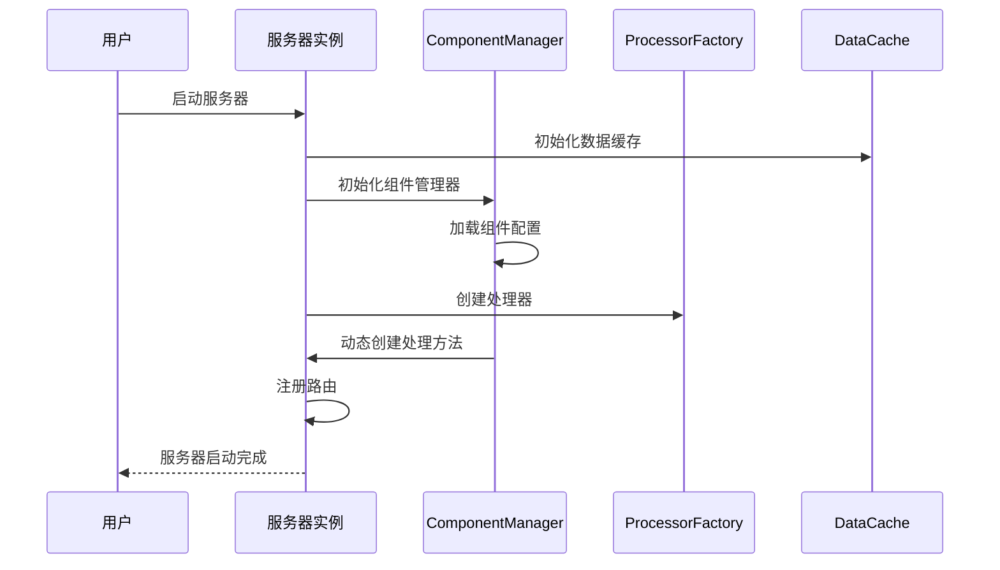
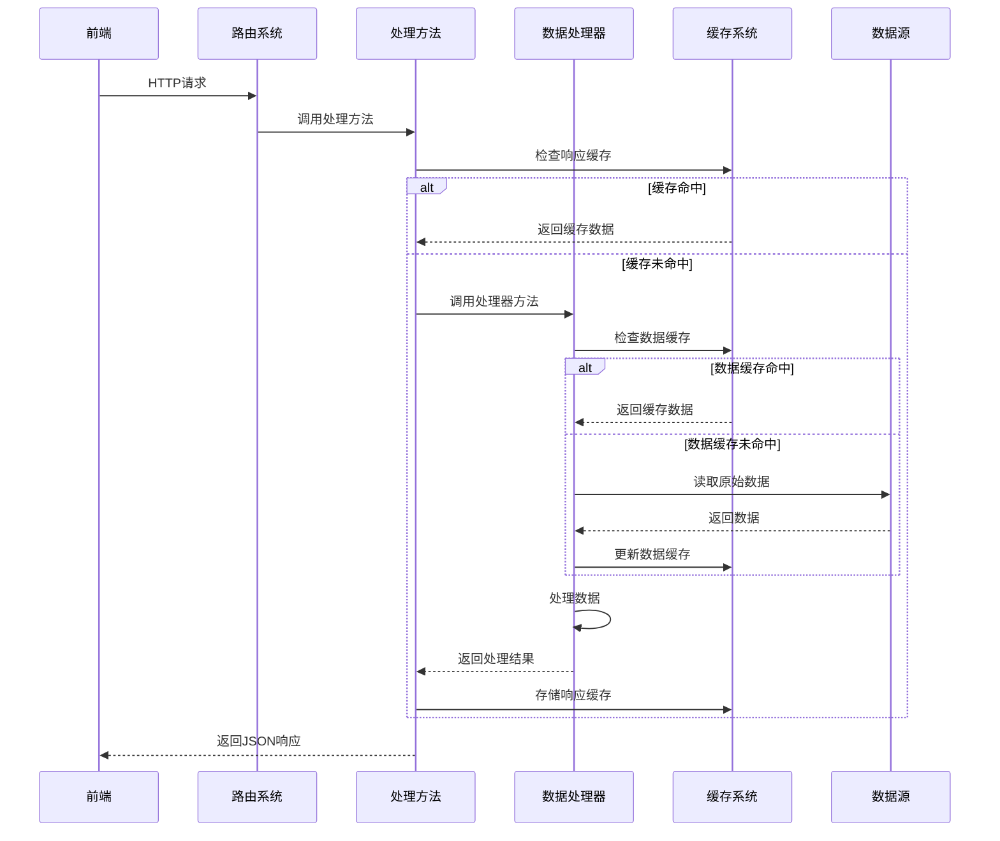
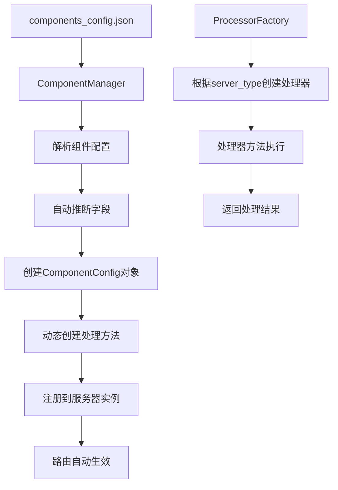
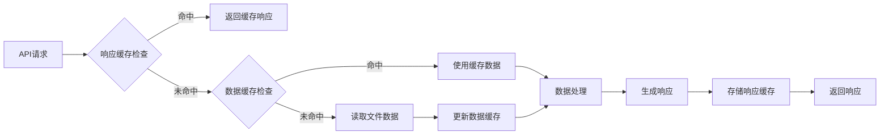

# Data Panel 项目详细结构分析

## 项目概述

`data_panel` 是一个现代化的 Web 数据可视化面板系统，采用 Vue.js + Flask 的前后端分离架构，提供股票/板块数据的实时展示和交互式分析功能。

## 完整目录树结构

```
data_panel/
├── 📂 api/                          # 后端 API 服务
│   ├── 📁 config/                   # 配置管理模块
│   ├── 📁 processors/               # 数据处理器模块
│   ├── 📁 static/                   # 静态文件服务
│   ├── 🐍 base_server.py           # 服务器基类
│   ├── 🐍 demo_server.py           # 演示服务器
│   ├── 🐍 show_plate_server_multiplate_v2.py  # 多板块服务器
│   └── 📋 其他工具和示例文件
├── 📂 src/                          # 前端 Vue.js 应用
│   ├── 📁 components/               # Vue 组件
│   ├── 📁 views/                    # 页面视图
│   ├── 📁 router/                   # 路由配置
│   ├── 📁 store/                    # 状态管理
│   └── 📁 utils/                    # 工具函数
├── 📂 public/                       # 静态资源
├── 📂 tests/                        # 测试文件
├── 📂 docs/                         # 项目文档
├── 📂 scripts/                      # 脚本工具
└── 📋 配置文件 (package.json, vue.config.js 等)
```

## 核心文件详细分析

### 📁 api/ - 后端 API 服务

#### 🐍 base_server.py - 服务器基类
**功能**: 通用股票仪表盘服务器框架，提供所有服务器的基础功能

**主要类**:
- **BaseDataCache**: 基础数据缓存类
  - `__init__(file_paths)`: 初始化缓存，设置文件路径映射
  - `load_data(key)`: 加载数据，优先使用缓存
  - `should_reload(file_key)`: 检查文件是否需要重新加载
  - `get_file_timestamp(file_path)`: 获取文件修改时间戳
  - `update_data(key, data)`: 更新缓存数据
  - `clear_cache()`: 清空所有缓存

- **BaseResponseCache**: 基础响应缓存类
  - `should_use_cache(endpoint, params, current_data)`: 判断是否使用缓存响应
  - `store_response(endpoint, params, source_data, response_data)`: 存储响应到缓存
  - `_calculate_data_hash(data)`: 计算数据哈希值
  - `_cleanup_cache()`: LRU缓存清理
  - `get_cache_stats()`: 获取缓存统计信息

- **BaseStockServer**: 股票仪表盘服务器基类
  - `__init__(name, port, auto_update_config)`: 初始化服务器
  - `_register_routes()`: 注册所有路由
  - `register_custom_routes()`: 子类自定义路由注册
  - `with_cache_protection()`: 通用缓存保护装饰器
  - `get_cache_status()`: 获取缓存状态
  - `clear_cache()`: 清理所有缓存
  - `run(debug, host)`: 启动服务器

#### 🐍 demo_server.py - 演示服务器
**功能**: 简化版演示股票服务器，使用配置驱动架构

**主要类**:
- **DemoStockServer**(BaseStockServer, SourceDataLogicMixin)
  - `__init__(port, auto_update_config)`: 初始化演示服务器
  - `get_data_cache_file_paths()`: 获取演示服务器数据文件路径
  - `get_dashboard_config()`: 获取仪表盘配置
  - `get_data_sources()`: 获取数据源配置

#### 🐍 show_plate_server_multiplate_v2.py - 多板块服务器
**功能**: 完整功能的多板块数据展示服务器

**主要类**:
- **MultiplateStockServer**(BaseStockServer, SourceDataLogicMixin)
  - `__init__(port, auto_update_config)`: 初始化多板块服务器
  - `get_data_cache_file_paths()`: 获取所有数据文件路径
  - `_get_dynamic_titles_list()`: 获取动态标题列表
  - `_update_dynamic_titles()`: 更新动态标题

### 📁 config/ - 配置管理模块

#### 🐍 component_config_multi.py - 组件配置管理
**功能**: 统一管理所有仪表盘组件的配置信息，支持多服务器

**主要类**:
- **ComponentConfig**: 组件配置类
  - `__init__(component_id, component_type, title, api_path, ...)`: 初始化组件配置
  - 自动推断功能: 从 `api_path` 自动生成 `handler` 和 `processor_method`

- **ComponentManager**: 组件管理器
  - `__init__(server_instance, server_type)`: 初始化组件管理器
  - `load_config()`: 从 JSON 文件加载配置
  - `get_dashboard_config()`: 获取仪表盘配置
  - `create_handler_methods()`: 动态创建处理方法
  - `_create_handler_method(component)`: 创建单个处理方法

#### 🐍 server_config.py - 服务器配置
**功能**: 管理不同服务器的配置信息

**主要函数**:
- `get_server_config(server_type)`: 获取指定服务器类型的配置
- `update_server_config(server_type, config)`: 更新服务器配置

#### 🐍 source_data_mixin.py - 数据源混入类
**功能**: 提供通用的数据源处理逻辑

**主要类**:
- **SourceDataLogicMixin**: 数据源逻辑混入类
  - 各种数据源处理方法
  - 数据转换和格式化功能

#### 📋 components_config.json - 组件配置文件
**功能**: 存储所有组件的配置信息

**配置结构**:
```json
{
  "multiplate": {
    "chart1": {
      "component_id": "chart1",
      "component_type": "chart",
      "title": "板块涨幅折线图",
      "api_path": "/api/sector_line_chart_change",
      "position": {...},
      "enabled": true
    }
  },
  "demo": {...},
  "strong": {...}
}
```

### 📁 processors/ - 数据处理器模块

#### 🐍 base_processor.py - 处理器基类
**功能**: 所有数据处理器的基类

**主要类**:
- **BaseDataProcessor**: 数据处理器基类
  - `__init__(server_instance)`: 初始化处理器
  - `error_response(message)`: 统一错误响应格式
  - `success_response(data)`: 统一成功响应格式

#### 🐍 multiplate_processor.py - 多板块处理器
**功能**: 多板块服务器的所有数据处理逻辑 (1072行)

**主要方法分类**:
- **图表处理方法**:
  - `process_sector_line_chart_change()`: 板块涨幅折线图
  - `process_sector_speed_chart()`: 板块涨速图表
  - `process_sector_momentum_chart()`: 板块动量图表
  - `process_sector_line_chart_uplimit()`: 板块涨停折线图

- **表格处理方法**:
  - `process_up_limit_table_data()`: 涨停数据表
  - `process_plate_info_table_data()`: 板块概要数据表
  - `process_stocks_table_data()`: 股票数据表

- **板块处理方法**:
  - `process_today_plate_up_limit_distribution()`: 板块涨停分布
  - `process_today_plate_up_limit_distribution_v2()`: 堆叠面积图版本

#### 🐍 demo_processor.py - 演示处理器
**功能**: 演示服务器的简化数据处理逻辑

#### 🐍 strong_processor.py - 强势处理器
**功能**: 强势股票分析的数据处理逻辑

#### 🐍 processor_factory.py - 处理器工厂
**功能**: 根据服务器类型创建对应的处理器

**主要类**:
- **ProcessorFactory**: 处理器工厂类
  - `create_processor(server_type, server_instance, data_cache, logger)`: 创建处理器实例
  - `get_supported_types()`: 获取支持的服务器类型
  - `register_processor(server_type, processor_class)`: 注册新处理器

- **SimplifiedProcessorManager**: 简化处理器管理器
  - `__init__(server_type, server_instance, data_cache, logger)`: 初始化管理器
  - `get_processor()`: 获取处理器实例

### 📁 src/ - 前端 Vue.js 应用

#### 📁 components/dashboard/ - 仪表盘组件
- **Dashboard.vue**: 主仪表盘组件
- **ChartComponent.vue**: 图表组件
- **TableComponent.vue**: 表格组件
- **StackedAreaChartComponent.vue**: 堆叠面积图组件
- **ComponentRenderer.vue**: 组件渲染器

#### 📁 views/ - 页面视图
- **StockDashboard.vue**: 股票仪表盘主页面
- **Home.vue**: 首页
- **StackedAreaDemo.vue**: 堆叠面积图演示页面

#### 📁 router/index.js - 路由配置
**功能**: Vue Router 路由配置

#### 📁 store/index.js - 状态管理
**功能**: Vuex 状态管理配置

#### 📁 utils/ - 工具函数
- **tableColorFunctions.js**: 表格颜色函数

## 系统处理流程

### 1. 系统启动流程



### 2. 请求处理流程



### 3. 配置驱动架构流程



### 4. 缓存机制流程



## 核心特性

### 1. 配置驱动架构
- 通过 JSON 配置文件管理所有组件
- 自动推断 handler 和 processor_method
- 动态路由注册，无需手动编写路由代码

### 2. 双层缓存机制
- **数据缓存**: 缓存原始文件数据，支持文件变化检测
- **响应缓存**: 缓存 API 响应，基于数据哈希值判断是否需要重新计算

### 3. 处理器模式
- 按服务器类型组织处理逻辑
- 工厂模式创建处理器实例
- 支持扩展新的服务器类型

### 4. 组件化前端
- Vue.js 3 组件化架构
- 支持多种图表类型 (线性图、柱状图、堆叠面积图)
- 响应式表格组件

### 5. 实时数据更新
- SSE (Server-Sent Events) 实时推送
- 自动刷新机制
- 多客户端支持

## 技术栈总结

### 后端技术
- **Python 3.11+**: 主要开发语言
- **Flask**: Web 框架，提供 RESTful API
- **Pandas**: 数据处理和分析
- **Plotly**: 图表生成和序列化
- **JSON**: 配置文件格式

### 前端技术
- **Vue.js 3**: 响应式前端框架
- **TypeScript**: 类型安全的 JavaScript
- **Plotly.js**: 交互式图表库
- **Element Plus**: UI 组件库

### 架构模式
- **MVC 模式**: 分离模型、视图、控制器
- **工厂模式**: 处理器创建
- **策略模式**: 不同服务器类型的处理策略
- **混入模式**: 数据源逻辑复用
- **配置驱动**: 减少硬编码，提高灵活性

## 总结

Data Panel 项目是一个设计精良的现代化数据可视化系统，具有以下优势：

1. **高度可扩展**: 配置驱动架构使添加新组件变得简单
2. **性能优化**: 双层缓存机制大幅提升响应速度
3. **代码简洁**: 自动推断减少配置冗余
4. **易于维护**: 模块化设计和清晰的职责分离
5. **用户友好**: 现代化的前端界面和实时数据更新

该系统通过合理的架构设计和技术选型，实现了一个功能完备、性能优良、易于扩展的股票数据可视化平台。
