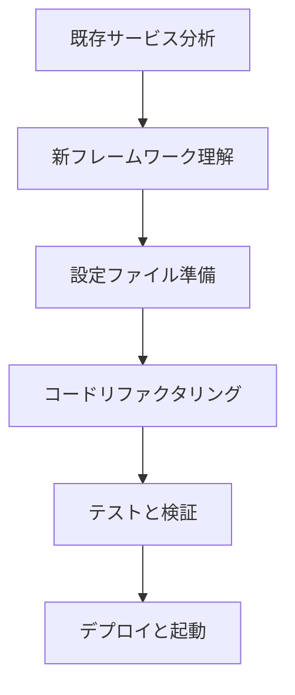

# 📄 新ページマイグレーションガイド

**作成者**: chenlei

## 🌟 概要

このガイドでは、新しいBase Server フレームワークを使用してページ追加・移行を行う方法について説明します。新フレームワークは、開発効率を向上させ、コードの保守性を高めることを目的としています。

## 🎯 学習目標

この文書を読み終えた後、以下のことができるようになります：
- 新しいbase_server.pyフレームワークの理解
- 既存サービスの新フレームワークへの移行
- プロジェクト統一設定システムの使用
- 効率的な開発ワークフローの構築

## 📚 前提知識

- Python Flask フレームワークの基礎
- Vue.js フロントエンド開発の基礎
- JSON設定ファイルの編集経験

## 🔄 移行フロー概要



## 🏗️ 新Base Serverフレームワーク

### アーキテクチャ概要

新しいbase_server.pyフレームワークは以下の特徴を持ちます：

1. **統一インターフェース**: すべてのサーバーが同じAPIパターンを使用
2. **自動ルーティング**: 設定に基づく自動ルート生成
3. **内蔵エラーハンドリング**: 統一されたエラー処理メカニズム
4. **キャッシュサポート**: インテリジェントなキャッシュ戦略
5. **SSEサポート**: リアルタイムデータ更新機能

### 核心構造

```python
from base_server import BaseStockServer

class YourService(BaseStockServer):
    def __init__(self, port=5004):
        super().__init__(port=port, service_name="サービス名")
    
    def get_dashboard_config(self):
        # ダッシュボード設定を返す
        
    def get_data_sources(self):
        # データソース設定を返す
        
    # ビジネスロジックメソッド
    def your_business_method(self):
        return self.handle_request_with_cache(lambda: {
            # ビジネス実装
        })
```

## 📋 既存サービスの移行手順

### ステップ1: 既存コード分析

移行前に、既存サービスの以下の内容を分析します：

1. **APIエンドポイント一覧**
2. **データ処理ロジック**
3. **ルーティング設定**
4. **エラーハンドリング方法**

### ステップ2: 新フレームワークでのコード実装

#### 2.1 基本構造の作成

```python
# api/show_plate_server_新服务.py
from base_server import BaseStockServer
import pandas as pd
import json

class NewStockServer(BaseStockServer):
    def __init__(self, port=XXXX):
        super().__init__(port=port, service_name="新サービス名")
        # 初期化処理
```

#### 2.2 ダッシュボード設定の実装

```python
def get_dashboard_config(self):
    """ダッシュボード設定を返す"""
    return {
        "title": "サービスタイトル",
        "layout": {
            "charts": [
                {
                    "id": "chart1",
                    "title": "チャート1",
                    "type": "line",
                    "config": {}
                }
            ],
            "tables": [
                {
                    "id": "table1", 
                    "title": "表1",
                    "config": {}
                }
            ]
        },
        "refreshInterval": 30
    }
```

#### 2.3 データソース設定の実装

```python
def get_data_sources(self):
    """データソース設定を返す"""
    return {
        "/api/chart-data/your-chart": {
            "handler": "get_your_chart_data",
            "description": "チャートデータ",
            "cache_ttl": 30
        },
        "/api/table-data/your-table": {
            "handler": "get_your_table_data", 
            "description": "表データ",
            "cache_ttl": 60
        }
    }
```

#### 2.4 ビジネスロジックの実装

```python
def get_your_chart_data(self):
    """チャートデータを取得"""
    return self.handle_request_with_cache(lambda: {
        # 元のビジネスロジックをここに移行
        # DataFrame処理
        # データ変換
        # JSON形式での返却
        "data": your_processed_data,
        "timestamp": datetime.now().isoformat()
    })

def get_your_table_data(self):
    """表データを取得"""
    return self.handle_request_with_cache(lambda: {
        # テーブルデータ処理ロジック
        "columns": column_definitions,
        "data": table_data
    })
```

### ステップ3: プロジェクト設定の更新

#### 3.1 project-config.json の更新

```json
{
  "services": [
    {
      "id": "StockDashboard_newservice",
      "name": "新サービス",
      "description": "新サービスの説明",
      "icon": "📊",
      "port": XXXX,
      "path": "/stock-dashboard-newservice",
      "title": "新サービスダッシュボード",
      "serverFile": "show_plate_server_newservice.py",
      "component": "StockDashboard",
      "taskLabel": "新サービスサーバー",
      "enabled": true
    }
  ]
}
```

#### 3.2 自動設定生成器の実行

```bash
python scripts/auto-config-generator.py
```

この操作により以下のファイルが自動生成・更新されます：
- `src/config/api.js`
- `src/router/index.js`
- `src/views/Home.vue`
- `.vscode/tasks.json`
- 起動スクリプト

### ステップ4: テストと検証

#### 4.1 サービス単体テスト

```bash
# 新サービスを個別に起動
python api/show_plate_server_newservice.py XXXX

# APIエンドポイントをテスト
curl http://localhost:XXXX/api/dashboard-config
curl http://localhost:XXXX/api/chart-data/your-chart
```

#### 4.2 フロントエンド統合テスト

```bash
# フロントエンドサービスを起動
npm run serve

# ブラウザでアクセス
http://localhost:8080/stock-dashboard-newservice
```

## 🔧 vue.config.js プロキシ設定

### 5.1 プロキシ設定の追加

複数のバックエンドサービスを使用する場合、`vue.config.js`でプロキシを設定する必要があります：

```javascript
module.exports = {
  devServer: {
    proxy: {
      // メインサービス (localhost:5004) への転送
      '^/api/(?!multiplate|strong|your-new-service)': {
        target: 'http://localhost:5004',
        changeOrigin: true,
        logLevel: 'debug'
      },
      
      // マルチプレートサービス (localhost:5003) への転送
      '/api/multiplate': {
        target: 'http://localhost:5003',
        changeOrigin: true,
        pathRewrite: {
          '^/api/multiplate': '/api'
        }
      },
      
      // 強勢株サービス (localhost:5002) への転送
      '/api/strong': {
        target: 'http://localhost:5002',
        changeOrigin: true,
        pathRewrite: {
          '^/api/strong': '/api'
        }
      }
      
      // 新サービスのプロキシ設定を追加
      // '/api/your-new-service': {
      //   target: 'http://localhost:XXXX',  // 新サーバーポート
      //   changeOrigin: true,
      //   pathRewrite: {
      //     '^/api/your-new-service': '/api'
      //   }
      // }
    }
  }
}
```

#### 5.2 プロキシ設定ルール

1. **パス一致優先度**：より具体的なパスを前に配置
2. **ポート一致性**：ポートが `project-config.json` の設定と一致することを確認
3. **パス書き換え**：`pathRewrite`を使用してパスプレフィックスを除去し、バックエンドが標準APIパスを受信できるようにする

#### 5.3 フロントエンド呼び出し方法

プロキシ設定後、フロントエンドは以下のように異なるサーバーを呼び出せます：

```javascript
// メインサーバー (localhost:5004) を呼び出し
axios.get('/api/dashboard-config')
axios.get('/api/table-data/stock-list')

// マルチプレートサーバー (localhost:5003) を呼び出し
axios.get('/api/multiplate/table-data/sector-list')
axios.get('/api/multiplate/dashboard-config')

// 強勢株サーバー (localhost:5002) を呼び出し
axios.get('/api/strong/table-data/up-limit')

// 新追加サーバーを呼び出し
axios.get('/api/your-new-service/your-endpoint')
```

#### 5.4 フロントエンドサービスの再起動

`vue.config.js`を修正した後、**フロントエンド開発サーバーを再起動する必要があります**：

```bash
# 現在のサービスを停止 (Ctrl+C)
# 再起動
npm run serve
```

#### 5.5 プロキシ設定の検証

1. **ブラウザネットワークパネルを確認**：リクエストが正しく転送されることを確認
2. **コンソールログを確認**：`logLevel: 'debug'`でプロキシ詳細が表示されます
3. **API呼び出しをテスト**：すべてのサーバーが正常に応答することを確認

⚠️ **重要な注意事項**：
- 新しいバックエンドサーバーを追加するたびに、`vue.config.js`を手動で更新する必要があります
- プロキシポートがバックエンドの実際のポートと一致することを確認してください
- プロキシ設定の順序が重要です。具体的なパスを汎用パスの前に配置してください

## 新サービスの一から作成

### 高速追加ツールの使用

```bash
python scripts\quick-add-page.py
```

プロンプトに従って入力：
- サービス名
- ポート番号
- 説明
- アイコン

ツールが自動的に以下を実行：
1. 新フレームワークベースのサービステンプレートを生成
2. プロジェクト設定を更新
3. 自動設定生成器を実行

### 手動作成ステップ

1. **サービスファイルを作成**：
   ```python
   # api/your_new_service.py
   from base_server import BaseStockServer
   
   class YourNewServer(BaseStockServer):
       def __init__(self, port=XXXX):
           super().__init__(port=port, service_name="サービス名")
       
       def get_dashboard_config(self):
           # ダッシュボード設定を実装
           
       def get_data_sources(self):
           # データソース設定を実装
   ```

2. **プロジェクト設定を更新**：
   `project-config.json`の`services`配列に新サービス設定を追加

3. **自動生成器を実行**：
   ```bash
   python scripts\auto-config-generator.py
   ```

## 移行チェックリスト

### 機能移行チェック

- [ ] ✅ ダッシュボード設定 (`get_dashboard_config`)
- [ ] ✅ データソース設定 (`get_data_sources`)
- [ ] ✅ すべてのチャートAPIメソッド
- [ ] ✅ すべてのテーブルAPIメソッド
- [ ] ✅ SSEリアルタイム更新機能
- [ ] ✅ エラーハンドリングとログ記録
- [ ] ✅ キャッシュメカニズム
- [ ] ✅ 動的タイトル管理

### 設定更新チェック

- [ ] ✅ プロジェクト設定ファイル更新
- [ ] ✅ VS Code タスク設定
- [ ] ✅ フロントエンドルーティング設定
- [ ] ✅ APIエンドポイント設定
- [ ] ✅ 起動スクリプト更新

### テスト検証

- [ ] ✅ サービス正常起動
- [ ] ✅ フロントエンドページアクセス
- [ ] ✅ APIインターフェース応答
- [ ] ✅ リアルタイム更新機能
- [ ] ✅ エラーハンドリングメカニズム

## フレームワーク優位性比較

### 旧フレームワークの問題
```python
# 各APIで手動ルート登録が必要
@app.route('/api/chart-data/sector-line-chart_change', methods=['GET'])
def get_sector_chart_data_change():
    # 大量の重複コード
    try:
        # ビジネスロジック
    except Exception as e:
        return jsonify({"error": str(e)}), 500

# 重複するルート登録
app.add_url_rule('/api/chart-data/sector-line-chart_change', 
                 'get_sector_chart_data_change', 
                 get_sector_chart_data_change, methods=['GET'])
```

### 新フレームワークの優位性
```python
# 自動ルート登録 - 設定駆動ベース
def get_data_sources(self):
    return {
        "/api/chart-data/sector-line-chart_change": {
            "handler": "get_sector_chart_data_change",  # 自動呼び出し
            "description": "セクター上昇率折れ線グラフデータ",
            "cache_ttl": 30
        }
    }

# ビジネスメソッドの実装のみで、手動ルート登録不要
def get_sector_chart_data_change(self):
    # ビジネスロジックに集中
    return self.handle_request_with_cache(lambda: {
        # ビジネス実装
    })
```

## よくある質問と解決策

### 1. Handler自動呼び出しメカニズム

**問題**：基本クラスがどのメソッドを呼び出すかをどう知るのか？

**解決策**：基本クラスのルーティング処理メカニズムを改善：
```python
# 基本クラス base_server.py の改善
def get_chart_data(self, chart_type):
    data_sources = self.get_data_sources()
    endpoint = f"/api/chart-data/{chart_type}"
    
    if endpoint in data_sources:
        config = data_sources[endpoint]
        if 'handler' in config:
            # 自動呼び出し対応のhandlerメソッド
            handler_method = getattr(self, config['handler'], None)
            if handler_method:
                return handler_method()
```

### 2. パス参照問題

**問題**：CSVファイルパスが異なる環境で一致しない可能性がある

**解決策**：相対パスまたは設定化パスを使用：
```python
# 設定ファイルでパスを管理することを推奨
def _get_file_paths(self):
    return {
        'plate_df': 'strategy/showhtml/server/good_plate_df.csv',
        'stock_df': 'strategy/showhtml/server/stock_df.csv',
    }
```

### 3. ポート競合

**問題**：新サービスポートが既存サービスと競合

**解決策**：
- `project-config.json`で使用済みポートを確認
- 自動設定生成器でポート一意性を検証
- 推奨ポート範囲：5000-5020

## ベストプラクティス

### 1. コード組織
- 既存のビジネスロジックを変更せずに保持
- 新フレームワークの統一エラーハンドリングを使用
- 自動handler呼び出しを活用してボイラープレートコードを削減

### 2. 設定管理
- 自動設定生成器を優先使用
- 手動設定後は必ず検証を実行
- 設定ファイルの同期を保持

### 3. テスト戦略
- 移行過程で元のサービスを比較用として保持
- 各機能を段階的に検証
- SSEなどの特殊機能が正常に動作することを確認

### 4. ドキュメント保守
- 移行過程での問題と解決策を記録
- APIドキュメントを更新
- 変更ログを維持

## まとめ

新フレームワークを使用することで：
1. **開発時間短縮** - 定型処理の自動化
2. **コード品質向上** - 統一された構造と処理
3. **保守性向上** - 明確な責任分離
4. **拡張性確保** - 柔軟なアーキテクチャ

この手順に従うことで、既存サービスを効率的に新フレームワークに移行できます。

---

**作成者**: chenlei  
**日付**: 2025-01-10  
**バージョン**: 1.0
