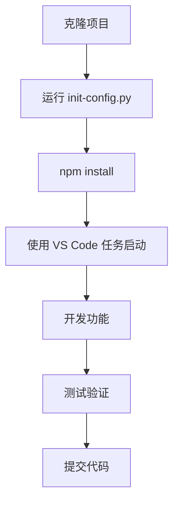
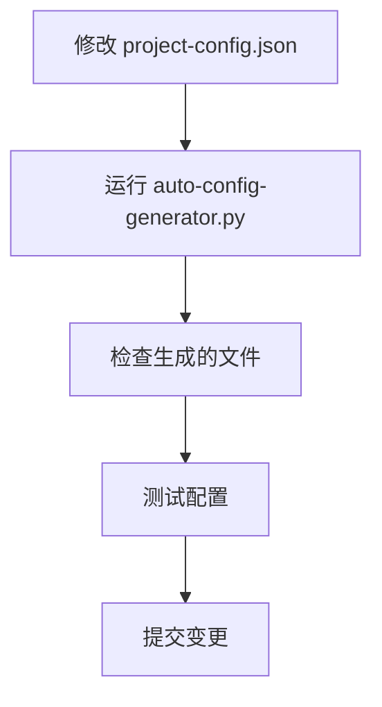

# 🎯 最佳实践指南

**作者**: chenlei

## 🏗️ 项目开发最佳实践

### 📁 目录结构规范

```
vue-project/
├── 📄 project-config.json      # 唯一配置源，版本控制
├── 🤖 auto-config-generator.py # 自动化工具，版本控制
├── 🔧 工具脚本/                # 版本控制
│   ├── init-config.py
│   └── quick-add-page.py
├── 🎛️ api/                    # 后端服务，版本控制
├── 🎨 src/                    # 前端源码
│   ├── components/            # 可复用组件，版本控制
│   ├── views/                 # 页面组件，版本控制
│   ├── utils/                 # 工具函数，版本控制
│   ├── config/ (自动生成)      # 不要手动修改
│   └── router/ (自动生成)      # 不要手动修改
├── 🛠️ .vscode/ (自动生成)     # 可选择版本控制
├── 📋 backup/                 # 自动备份，不版本控制
└── 📦 node_modules/           # 依赖目录，不版本控制
```

### 🔄 开发工作流

#### 1. 标准开发流程


#### 2. 配置变更流程


### 🎨 前端开发规范

#### Vue 组件规范

**1. 组件文件命名**
```
PascalCase.vue        # 推荐：StockDashboard.vue
kebab-case.vue        # 可选：stock-dashboard.vue
```

**2. 组件结构**
```vue
<template>
  <!-- 模板部分 -->
</template>

<script>
// 脚本部分
export default {
  name: 'ComponentName',
  props: {
    // 属性定义
  },
  data() {
    return {
      // 响应式数据
    }
  },
  methods: {
    // 方法定义
  }
}
</script>

<style scoped>
/* 样式部分 */
</style>
```

**3. 组件通信最佳实践**
```javascript
// Props 传递数据（父→子）
props: {
  componentConfig: {
    type: Object,
    required: true
  }
}

// Events 传递事件（子→父）
this.$emit('update-data', newData)

// 全局事件总线（跨组件）
window.dispatchEvent(new CustomEvent('dashboard-update', {
  detail: updateData
}))
```

#### API 调用规范

**1. 统一的 API 配置**
```javascript
// 使用自动生成的 API 配置
import { API_CONFIG } from '@/config/api'

// 获取 API 基础 URL
const baseUrl = API_CONFIG[serviceId]?.baseUrl
```

**2. 错误处理**
```javascript
async function fetchData(url) {
  try {
    const response = await axios.get(url)
    return response.data
  } catch (error) {
    console.error('API 请求失败:', error)
    // 用户友好的错误提示
    this.showError('数据加载失败，请重试')
    return null
  }
}
```

**3. 加载状态管理**
```javascript
data() {
  return {
    loading: false,
    error: null,
    data: null
  }
}

async methods: {
  async loadData() {
    this.loading = true
    this.error = null
    
    try {
      this.data = await fetchData(this.apiUrl)
    } catch (error) {
      this.error = error.message
    } finally {
      this.loading = false
    }
  }
}
```

### 🔧 后端开发规范

#### Flask 服务规范

**1. 服务文件结构**
```python
# 导入依赖
from flask import Flask, jsonify, request
from flask_cors import CORS
import random
import time

# 创建应用
app = Flask(__name__)
CORS(app)

# 配置常量
PORT = 5004
DEBUG_MODE = True

# 路由定义
@app.route('/health')
def health_check():
    return jsonify({"status": "healthy", "timestamp": time.time()})

@app.route('/api/dashboard-config')
def get_dashboard_config():
    # 实现逻辑
    pass

# 启动服务
if __name__ == '__main__':
    app.run(host='0.0.0.0', port=PORT, debug=DEBUG_MODE)
```

**2. API 响应格式**
```python
# 成功响应
{
  "status": "success",
  "data": {
    "columns": [...],
    "rows": [...]
  },
  "timestamp": 1641234567.89
}

# 错误响应
{
  "status": "error",
  "message": "具体错误信息",
  "code": "ERROR_CODE",
  "timestamp": 1641234567.89
}
```

**3. 数据模拟规范**
```python
def generate_mock_data(count=20):
    """生成模拟数据"""
    data = []
    for i in range(count):
        item = {
            'id': f'stock_{i:03d}',
            'name': f'股票{i+1:03d}',
            'price': round(random.uniform(10, 200), 2),
            'change': round(random.uniform(-10, 10), 2)
        }
        data.append(item)
    return data
```

### 📊 数据可视化最佳实践

#### 背景色函数开发

**1. 函数命名规范**
```javascript
// 功能描述性命名
heatmap          // 热力图
redGreen         // 红绿色阶
technicalAnalysis // 技术分析
priceRange       // 价格区间
```

**2. 函数参数标准**
```javascript
function customFunction(value, column, row, allRows) {
  // value: 当前单元格值
  // column: 列配置对象
  // row: 当前行数据
  // allRows: 所有行数据
  
  // 返回 CSS 背景色字符串
  return 'rgba(255, 0, 0, 0.5)'
}
```

**3. 颜色值规范**
```javascript
// 使用 RGBA 格式，便于透明度控制
'rgba(255, 0, 0, 0.5)'    // 半透明红色
'rgba(0, 255, 0, 0.3)'    // 浅绿色
'rgba(0, 0, 255, 0.8)'    // 深蓝色

// 避免使用不支持透明度的格式
'#ff0000'                 // 不推荐
'red'                     // 不推荐
```

### 🚀 性能优化

#### 前端性能优化

**1. 组件懒加载**
```javascript
const StockDashboard = () => import('@/views/StockDashboard.vue')
```

**2. 数据缓存**
```javascript
// 使用 Vue 的计算属性缓存
computed: {
  processedData() {
    // 复杂计算会被缓存
    return this.rawData.map(item => {
      return {
        ...item,
        processed: expensiveOperation(item)
      }
    })
  }
}
```

**3. 事件防抖**
```javascript
import { debounce } from 'lodash'

methods: {
  onSearch: debounce(function(query) {
    this.performSearch(query)
  }, 300)
}
```

#### 后端性能优化

**1. 数据预处理**
```python
# 在应用启动时预生成数据
mock_data = generate_large_dataset()

@app.route('/api/data')
def get_data():
    # 直接返回预处理的数据
    return jsonify(mock_data)
```

**2. 响应压缩**
```python
from flask_compress import Compress

app = Flask(__name__)
Compress(app)  # 自动压缩响应
```

### 🔍 调试与测试

#### 调试技巧

**1. 前端调试**
```javascript
// 在关键位置添加调试信息
console.group('API 调用')
console.log('请求 URL:', url)
console.log('请求参数:', params)
console.log('响应数据:', response)
console.groupEnd()

// 使用 Vue DevTools
this.$nextTick(() => {
  console.log('DOM 更新完成')
})
```

**2. 后端调试**
```python
import logging

# 设置日志级别
logging.basicConfig(level=logging.DEBUG)

@app.route('/api/data')
def get_data():
    logging.info(f'收到请求: {request.method} {request.path}')
    # 业务逻辑
    logging.debug(f'返回数据条数: {len(data)}')
    return jsonify(data)
```

#### 测试策略

**1. 前端测试**
```javascript
// 组件单元测试
import { mount } from '@vue/test-utils'
import StockDashboard from '@/views/StockDashboard.vue'

test('组件正常渲染', () => {
  const wrapper = mount(StockDashboard, {
    props: {
      config: mockConfig
    }
  })
  expect(wrapper.find('.dashboard').exists()).toBe(true)
})
```

**2. API 测试**
```python
import unittest
import json

class APITestCase(unittest.TestCase):
    def setUp(self):
        self.app = app.test_client()
    
    def test_health_check(self):
        response = self.app.get('/health')
        self.assertEqual(response.status_code, 200)
        data = json.loads(response.data)
        self.assertEqual(data['status'], 'healthy')
```

### 🔒 安全最佳实践

#### 前端安全

**1. 输入验证**
```javascript
// 验证用户输入
function validateInput(value) {
  if (!value || typeof value !== 'string') {
    return false
  }
  // 防止 XSS 攻击
  return !/<script|javascript:/i.test(value)
}
```

**2. 敏感数据处理**
```javascript
// 不要在前端存储敏感信息
// 使用 HTTPS 传输
// 验证 API 响应格式
```

#### 后端安全

**1. 请求验证**
```python
from flask import request
import re

@app.before_request
def validate_request():
    # 验证请求来源
    if request.method == 'POST':
        content_type = request.headers.get('Content-Type', '')
        if 'application/json' not in content_type:
            return jsonify({'error': 'Invalid content type'}), 400
```

**2. CORS 配置**
```python
from flask_cors import CORS

# 生产环境中限制允许的域名
CORS(app, origins=['http://localhost:8081'])
```

### 📚 文档维护

#### 代码注释规范

**1. 函数注释**
```javascript
/**
 * 计算股票技术分析评分
 * @param {number} value - 当前值
 * @param {Object} column - 列配置
 * @param {Object} row - 行数据
 * @param {Array} allRows - 所有数据
 * @returns {string} CSS 背景色
 */
function technicalAnalysis(value, column, row, allRows) {
  // 实现逻辑
}
```

**2. 复杂逻辑注释**
```javascript
// 计算 RSI 评分 (0-100)
// RSI > 70: 超买状态，评分偏低
// RSI < 30: 超卖状态，评分偏高
// RSI 30-70: 正常状态，评分中等
const rsiScore = calculateRsiScore(row.rsi)
```

#### 文档更新流程

1. **代码变更时同步更新文档**
2. **使用 Markdown 格式编写技术文档**
3. **定期审查和更新过时的文档**
4. **维护变更日志和版本说明**
