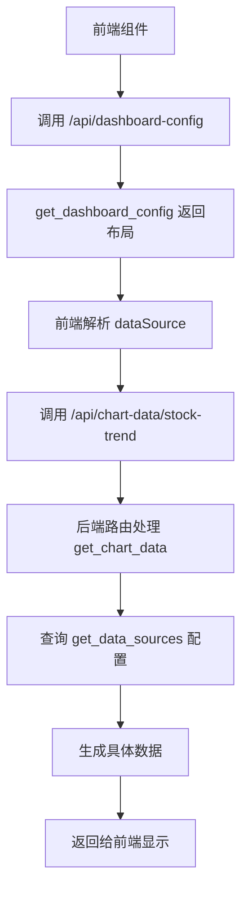

# 📚 BaseStockServer 数据源配置详解

## 🎯 核心概念解释

在 `BaseStockServer` 框架中，`get_dashboard_config()` 和 `get_data_sources()` 这两个方法承担着不同的职责，理解它们的区别对于正确使用框架至关重要。

## 📊 get_dashboard_config() - 前端布局配置

### 作用
`get_dashboard_config()` 定义的是**前端界面的布局和组件配置**，告诉前端：
- 页面上应该显示哪些组件
- 组件的位置和大小
- 每个组件应该从哪个API端点获取数据

### dataSource 的作用
在 `get_dashboard_config()` 中的 `dataSource` 是**API端点路径**，用于指定前端组件应该调用哪个URL来获取数据。

```python
def get_dashboard_config(self) -> Dict[str, Any]:
    return {
        "layout": {
            "components": [
                {
                    "id": "chart1",
                    "type": "chart", 
                    "dataSource": "/api/chart-data/stock-trend",  # ← 这是API端点URL
                    "title": "股票走势图",
                    "position": {"row": 0, "col": 0, "rowSpan": 1, "colSpan": 1}
                }
            ]
        }
    }
```

**流程**: 前端 → 读取配置 → 调用 `/api/chart-data/stock-trend` → 获取具体数据

## 🔧 get_data_sources() - 后端数据配置

### 作用  
`get_data_sources()` 定义的是**后端如何生成和处理数据**，告诉后端：
- 有哪些数据源可用
- 每种数据类型如何生成
- 数据的结构和格式

### 配置内容
这个方法返回的是数据生成的**配置和规则**，而不是具体的API路径。

```python
def get_data_sources(self) -> Dict[str, Any]:
    return {
        "tables": {
            "stock-list": {
                "fields": ["股票代码", "股票名称", "现价", "涨跌幅"],
                "data_generator": "generate_mock_stock_data",
                "refresh_interval": 5000
            }
        },
        "charts": {
            "stock-trend": {
                "type": "line",
                "data_generator": "generate_trend_data", 
                "update_frequency": "realtime"
            }
        }
    }
```

## 🔄 两者的关系和数据流

### 完整的数据流程：

1. **前端启动** → 调用 `/api/dashboard-config` 
2. **后端返回** → `get_dashboard_config()` 的结果
3. **前端解析** → 知道要显示什么组件，从哪里获取数据
4. **前端请求数据** → 调用 `dataSource` 指定的URL (如 `/api/chart-data/stock-trend`)
5. **后端路由处理** → 基类的 `get_chart_data()` 方法被调用
6. **后端查询配置** → `get_data_sources()` 获取如何生成数据的配置
7. **后端生成数据** → 根据配置调用相应的数据生成方法
8. **返回数据** → 前端接收并显示



## 💡 实际示例对比

### 当前 show_plate_server_v2.py 的实现问题

```python
# ❌ 当前的实现 - get_data_sources 返回空配置
def get_data_sources(self) -> Dict[str, Any]:
    return {
        "tables": {
            # 使用基类的默认实现  ← 这里是空的
        },
        "charts": {
            # 使用基类的默认实现  ← 这里也是空的
        }
    }
```

这样的实现是有问题的，因为：
1. `get_dashboard_config()` 指定了 `dataSource: "/api/chart-data/stock-trend"`
2. 但 `get_data_sources()` 没有配置如何生成这些数据
3. 后端不知道如何处理前端的数据请求

### ✅ 正确的实现方式

```python
def get_data_sources(self) -> Dict[str, Any]:
    return {
        "tables": {
            "stock-list": {
                "generator": "generate_mock_stock_data",
                "params": {"count": 20}
            },
            "sector-list": {
                "generator": "generate_mock_sector_data", 
                "params": {}
            }
        },
        "charts": {
            "stock-trend": {
                "type": "line",
                "generator": "generate_time_series_data",
                "params": {"days": 30}
            },
            "sector-performance": {
                "type": "bar", 
                "generator": "generate_sector_performance_data",
                "params": {"sectors": 10}
            },
            "volume-analysis": {
                "type": "bar",
                "generator": "generate_volume_analysis_data", 
                "params": {"stocks": 10}
            }
        }
    }
```

## 🛠️ 框架工作原理

基类 `BaseStockServer` 提供了通用的路由处理：

```python
# 基类中的路由处理
def get_chart_data(self, chart_type):
    # 1. 从 get_data_sources() 获取配置
    data_sources = self.get_data_sources()
    chart_config = data_sources.get("charts", {}).get(chart_type)
    
    # 2. 根据配置生成数据
    if chart_config:
        generator = chart_config.get("generator")
        params = chart_config.get("params", {})
        # 调用相应的数据生成方法
        return generate_data(generator, params)
    
    # 3. 返回默认实现 (当前的fallback)
    return self._generate_default_chart(chart_type)
```

## 📝 总结

| 方法 | 作用域 | 内容 | 目的 |
|------|--------|------|------|
| `get_dashboard_config()` | **前端** | API端点URL | 告诉前端组件布局和数据获取路径 |
| `get_data_sources()` | **后端** | 数据生成配置 | 告诉后端如何生成和处理数据 |

两者配合工作：
- **前端配置** 决定"要什么数据，从哪里要"
- **后端配置** 决定"怎么生成数据，用什么方法"

这种设计实现了前后端的解耦，让数据生成逻辑和界面布局逻辑分离，提高了系统的灵活性和可维护性。

---
**Author**: chenlei  
**Date**: 2025-01-10
